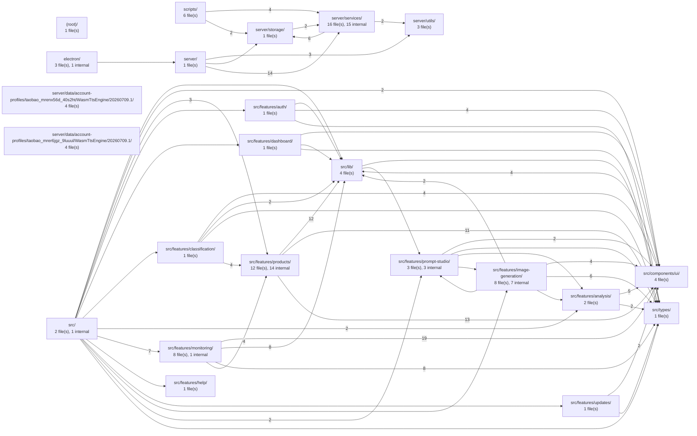

# Repository Code Graph

_Generated 2026-07-17T17:38:43.209Z from `graph.json`._

- **Root:** `D:/电商监控`
- **Files indexed:** 88
- **Import edges:** 231

---

## 1. Folder-level overview

Each box is a folder (module). Arrows are imports that cross folder boundaries; edge labels show how many file-to-file imports collapse into one arrow. Use this to see how the repo is split into modules and which ones depend on which.



## 2. File-level dependency graph

Each box is a source file, grouped by folder. Arrows are `import` / `require` relationships resolved to in-repo files. Colors flag the role each file plays.


> Showing 80 of 88 files (files with imports first). Raise `CODEGRAPH_MAX_NODES` to include more.
```mermaid
graph LR
  subgraph n_electron["electron/"]
    n_electron_launchMode_mjs["launchMode.mjs"]
    n_electron_main_mjs["main.mjs"]
    n_electron_preload_mjs["preload.mjs"]
  end
  subgraph n_scripts["scripts/"]
    n_scripts_capture_doc_screenshots_mjs["capture-doc-screenshots.mjs"]
    n_scripts_decode_dts_runtime_mjs["decode-dts-runtime.mjs"]
    n_scripts_inspect_buyer_show_mjs["inspect-buyer-show.mjs"]
    n_scripts_inspect_dts_chunks_mjs["inspect-dts-chunks.mjs"]
    n_scripts_inspect_price_evidence_mjs["inspect-price-evidence.mjs"]
    n_scripts_make_icon_mjs["make-icon.mjs"]
  end
  subgraph n_server["server/"]
    n_server_index_js["index.js"]
  end
  subgraph n_server_data_account_profiles_taobao_mrenx56d_40s2ht_WasmTtsEngine_20260709_1["server/data/account-profiles/taobao_mrenx56d_40s2ht/WasmTtsEngine/20260709.1/"]
    n_server_data_account_profiles_taobao_mrenx56d_40s2ht_WasmTtsEngine_20260709_1_background_compiled_js["background_compiled.js"]
  end
  subgraph n_server_services["server/services/"]
    n_server_services_analysisService_js["analysisService.js"]
    n_server_services_authService_js["authService.js"]
    n_server_services_browserService_js["browserService.js"]
    n_server_services_feishuService_js["feishuService.js"]
    n_server_services_imageGenerationService_js["imageGenerationService.js"]
    n_server_services_imageJobService_js["imageJobService.js"]
    n_server_services_larkCliService_js["larkCliService.js"]
    n_server_services_localImportService_js["localImportService.js"]
    n_server_services_modelConfigService_js["modelConfigService.js"]
    n_server_services_monitorService_js["monitorService.js"]
    n_server_services_photoshopService_js["photoshopService.js"]
    n_server_services_priceResolver_js["priceResolver.js"]
    n_server_services_promptStudioService_js["promptStudioService.js"]
    n_server_services_secretService_js["secretService.js"]
    n_server_services_tmallScraper_js["tmallScraper.js"]
    n_server_services_updateService_js["updateService.js"]
  end
  subgraph n_server_storage["server/storage/"]
    n_server_storage_db_js["db.js"]
  end
  subgraph n_server_utils["server/utils/"]
    n_server_utils_env_js["env.js"]
    n_server_utils_localOrigin_js["localOrigin.js"]
    n_server_utils_productUrl_js["productUrl.js"]
  end
  subgraph n_src["src/"]
    n_src_App_tsx["App.tsx"]
    n_src_main_tsx["main.tsx"]
  end
  subgraph n_src_components_ui["src/components/ui/"]
    n_src_components_ui_badge_tsx["badge.tsx"]
    n_src_components_ui_button_tsx["button.tsx"]
    n_src_components_ui_card_tsx["card.tsx"]
    n_src_components_ui_input_tsx["input.tsx"]
  end
  subgraph n_src_features_analysis["src/features/analysis/"]
    n_src_features_analysis_AnalysisPanel_tsx["AnalysisPanel.tsx"]
    n_src_features_analysis_ModelConfigPanel_tsx["ModelConfigPanel.tsx"]
  end
  subgraph n_src_features_auth["src/features/auth/"]
    n_src_features_auth_AuthPanel_tsx["AuthPanel.tsx"]
  end
  subgraph n_src_features_classification["src/features/classification/"]
    n_src_features_classification_MonitorClassification_tsx["MonitorClassification.tsx"]
  end
  subgraph n_src_features_dashboard["src/features/dashboard/"]
    n_src_features_dashboard_MetricCards_tsx["MetricCards.tsx"]
  end
  subgraph n_src_features_help["src/features/help/"]
    n_src_features_help_HelpCenter_tsx["HelpCenter.tsx"]
  end
  subgraph n_src_features_image_generation["src/features/image-generation/"]
    n_src_features_image_generation_ImageAnnotationDialog_tsx["ImageAnnotationDialog.tsx"]
    n_src_features_image_generation_ImageDetailDialog_tsx["ImageDetailDialog.tsx"]
    n_src_features_image_generation_imageJobOutbox_ts["imageJobOutbox.ts"]
    n_src_features_image_generation_ImageJobQueue_tsx["ImageJobQueue.tsx"]
    n_src_features_image_generation_imageJobRequestGate_ts["imageJobRequestGate.ts"]
    n_src_features_image_generation_imagePromptLimits_ts["imagePromptLimits.ts"]
    n_src_features_image_generation_ImageWorkbench_tsx["ImageWorkbench.tsx"]
    n_src_features_image_generation_ReferenceImagePicker_tsx["ReferenceImagePicker.tsx"]
  end
  subgraph n_src_features_monitoring["src/features/monitoring/"]
    n_src_features_monitoring_BatchCaptureCard_tsx["BatchCaptureCard.tsx"]
    n_src_features_monitoring_CaptureQueue_tsx["CaptureQueue.tsx"]
    n_src_features_monitoring_DataRecords_tsx["DataRecords.tsx"]
    n_src_features_monitoring_FeishuSettings_tsx["FeishuSettings.tsx"]
    n_src_features_monitoring_MonitorQueue_tsx["MonitorQueue.tsx"]
    n_src_features_monitoring_MonitorScheduleDialog_tsx["MonitorScheduleDialog.tsx"]
    n_src_features_monitoring_RunLog_tsx["RunLog.tsx"]
    n_src_features_monitoring_SnapshotFeed_tsx["SnapshotFeed.tsx"]
  end
  subgraph n_src_features_products["src/features/products/"]
    n_src_features_products_DiscountDetailDialog_tsx["DiscountDetailDialog.tsx"]
    n_src_features_products_LocalImportDialog_tsx["LocalImportDialog.tsx"]
    n_src_features_products_PriceVerificationDialog_tsx["PriceVerificationDialog.tsx"]
    n_src_features_products_productDisplay_tsx["productDisplay.tsx"]
    n_src_features_products_productDisplayUtils_ts["productDisplayUtils.ts"]
    n_src_features_products_ProductForm_tsx["ProductForm.tsx"]
    n_src_features_products_ProductMonitorCard_tsx["ProductMonitorCard.tsx"]
    n_src_features_products_productSchedule_ts["productSchedule.ts"]
    n_src_features_products_productSort_ts["productSort.ts"]
    n_src_features_products_ProductTable_tsx["ProductTable.tsx"]
    n_src_features_products_RawDataViewerDialog_tsx["RawDataViewerDialog.tsx"]
    n_src_features_products_SkuPriceTrend_tsx["SkuPriceTrend.tsx"]
  end
  subgraph n_src_features_prompt_studio["src/features/prompt-studio/"]
    n_src_features_prompt_studio_promptDraftStorage_ts["promptDraftStorage.ts"]
    n_src_features_prompt_studio_PromptWorkbench_tsx["PromptWorkbench.tsx"]
    n_src_features_prompt_studio_types_ts["types.ts"]
  end
  subgraph n_src_features_updates["src/features/updates/"]
    n_src_features_updates_UpdateDialog_tsx["UpdateDialog.tsx"]
  end
  subgraph n_src_lib["src/lib/"]
    n_src_lib_api_ts["api.ts"]
    n_src_lib_download_ts["download.ts"]
    n_src_lib_productUrl_ts["productUrl.ts"]
    n_src_lib_utils_ts["utils.ts"]
  end
  subgraph n_src_types["src/types/"]
    n_src_types_domain_ts["domain.ts"]
  end
  n_electron_main_mjs --> n_electron_launchMode_mjs
  n_electron_main_mjs --> n_server_index_js
  n_scripts_inspect_buyer_show_mjs --> n_server_services_browserService_js
  n_scripts_inspect_buyer_show_mjs --> n_server_services_tmallScraper_js
  n_scripts_inspect_buyer_show_mjs --> n_server_storage_db_js
  n_scripts_inspect_price_evidence_mjs --> n_server_services_browserService_js
  n_scripts_inspect_price_evidence_mjs --> n_server_services_priceResolver_js
  n_scripts_inspect_price_evidence_mjs --> n_server_storage_db_js
  n_server_index_js --> n_server_utils_env_js
  n_server_index_js --> n_server_storage_db_js
  n_server_index_js --> n_server_services_analysisService_js
  n_server_index_js --> n_server_services_authService_js
  n_server_index_js --> n_server_services_monitorService_js
  n_server_index_js --> n_server_services_feishuService_js
  n_server_index_js --> n_server_services_larkCliService_js
  n_server_index_js --> n_server_services_browserService_js
  n_server_index_js --> n_server_services_tmallScraper_js
  n_server_index_js --> n_server_utils_productUrl_js
  n_server_index_js --> n_server_services_updateService_js
  n_server_index_js --> n_server_services_imageGenerationService_js
  n_server_index_js --> n_server_services_imageJobService_js
  n_server_index_js --> n_server_services_photoshopService_js
  n_server_index_js --> n_server_services_modelConfigService_js
  n_server_index_js --> n_server_services_promptStudioService_js
  n_server_index_js --> n_server_services_localImportService_js
  n_server_index_js --> n_server_utils_localOrigin_js
  n_server_services_analysisService_js --> n_server_services_modelConfigService_js
  n_server_services_feishuService_js --> n_server_storage_db_js
  n_server_services_imageGenerationService_js --> n_server_storage_db_js
  n_server_services_imageGenerationService_js --> n_server_services_modelConfigService_js
  n_server_services_imageJobService_js --> n_server_storage_db_js
  n_server_services_imageJobService_js --> n_server_services_imageGenerationService_js
  n_server_services_localImportService_js --> n_server_storage_db_js
  n_server_services_localImportService_js --> n_server_services_priceResolver_js
  n_server_services_localImportService_js --> n_server_services_tmallScraper_js
  n_server_services_modelConfigService_js --> n_server_services_secretService_js
  n_server_services_monitorService_js --> n_server_storage_db_js
  n_server_services_monitorService_js --> n_server_utils_productUrl_js
  n_server_services_monitorService_js --> n_server_services_tmallScraper_js
  n_server_services_monitorService_js --> n_server_services_feishuService_js
  n_server_services_monitorService_js --> n_server_services_larkCliService_js
  n_server_services_monitorService_js --> n_server_services_localImportService_js
  n_server_services_photoshopService_js --> n_server_storage_db_js
  n_server_services_photoshopService_js --> n_server_services_imageGenerationService_js
  n_server_services_promptStudioService_js --> n_server_services_modelConfigService_js
  n_server_services_tmallScraper_js --> n_server_utils_productUrl_js
  n_server_services_tmallScraper_js --> n_server_services_browserService_js
  n_server_services_tmallScraper_js --> n_server_services_priceResolver_js
  n_server_services_tmallScraper_js --> n_server_services_localImportService_js
  n_server_storage_db_js --> n_server_services_modelConfigService_js
  n_server_storage_db_js --> n_server_services_promptStudioService_js
  n_src_App_tsx --> n_src_lib_api_ts
  n_src_App_tsx --> n_src_components_ui_button_tsx
  n_src_App_tsx --> n_src_components_ui_badge_tsx
  n_src_App_tsx --> n_src_features_products_ProductForm_tsx
  n_src_App_tsx --> n_src_features_products_LocalImportDialog_tsx
  n_src_App_tsx --> n_src_features_auth_AuthPanel_tsx
  n_src_App_tsx --> n_src_features_dashboard_MetricCards_tsx
  n_src_App_tsx --> n_src_features_products_ProductTable_tsx
  n_src_App_tsx --> n_src_features_classification_MonitorClassification_tsx
  n_src_App_tsx --> n_src_features_analysis_AnalysisPanel_tsx
  n_src_App_tsx --> n_src_features_analysis_ModelConfigPanel_tsx
  n_src_App_tsx --> n_src_features_monitoring_SnapshotFeed_tsx
  n_src_App_tsx --> n_src_features_monitoring_DataRecords_tsx
  n_src_App_tsx --> n_src_features_monitoring_FeishuSettings_tsx
  n_src_App_tsx --> n_src_features_monitoring_BatchCaptureCard_tsx
  n_src_App_tsx --> n_src_features_monitoring_RunLog_tsx
  n_src_App_tsx --> n_src_features_monitoring_MonitorQueue_tsx
  n_src_App_tsx --> n_src_features_monitoring_CaptureQueue_tsx
  n_src_App_tsx --> n_src_features_help_HelpCenter_tsx
  n_src_App_tsx --> n_src_features_updates_UpdateDialog_tsx
  n_src_App_tsx --> n_src_features_image_generation_ImageWorkbench_tsx
  n_src_App_tsx --> n_src_features_prompt_studio_types_ts
  n_src_App_tsx --> n_src_types_domain_ts
  n_src_App_tsx --> n_src_features_prompt_studio_PromptWorkbench_tsx
  n_src_components_ui_badge_tsx --> n_src_lib_utils_ts
  n_src_components_ui_button_tsx --> n_src_lib_utils_ts
  n_src_components_ui_card_tsx --> n_src_lib_utils_ts
  n_src_components_ui_input_tsx --> n_src_lib_utils_ts
  n_src_features_analysis_AnalysisPanel_tsx --> n_src_components_ui_button_tsx
  n_src_features_analysis_AnalysisPanel_tsx --> n_src_components_ui_card_tsx
  n_src_features_analysis_AnalysisPanel_tsx --> n_src_types_domain_ts
  n_src_features_analysis_ModelConfigPanel_tsx --> n_src_components_ui_button_tsx
  n_src_features_analysis_ModelConfigPanel_tsx --> n_src_components_ui_card_tsx
  n_src_features_analysis_ModelConfigPanel_tsx --> n_src_components_ui_input_tsx
  n_src_features_analysis_ModelConfigPanel_tsx --> n_src_types_domain_ts
  n_src_features_auth_AuthPanel_tsx --> n_src_lib_api_ts
  n_src_features_auth_AuthPanel_tsx --> n_src_components_ui_button_tsx
  n_src_features_auth_AuthPanel_tsx --> n_src_components_ui_card_tsx
  n_src_features_auth_AuthPanel_tsx --> n_src_components_ui_input_tsx
  n_src_features_auth_AuthPanel_tsx --> n_src_components_ui_badge_tsx
  n_src_features_auth_AuthPanel_tsx --> n_src_types_domain_ts
  n_src_features_classification_MonitorClassification_tsx --> n_src_components_ui_badge_tsx
  n_src_features_classification_MonitorClassification_tsx --> n_src_components_ui_button_tsx
  n_src_features_classification_MonitorClassification_tsx --> n_src_components_ui_card_tsx
  n_src_features_classification_MonitorClassification_tsx --> n_src_components_ui_input_tsx
  n_src_features_classification_MonitorClassification_tsx --> n_src_lib_utils_ts
  n_src_features_classification_MonitorClassification_tsx --> n_src_lib_download_ts
  n_src_features_classification_MonitorClassification_tsx --> n_src_types_domain_ts
  n_src_features_classification_MonitorClassification_tsx --> n_src_features_products_productDisplay_tsx
  n_src_features_classification_MonitorClassification_tsx --> n_src_features_products_ProductMonitorCard_tsx
  n_src_features_classification_MonitorClassification_tsx --> n_src_features_products_productDisplayUtils_ts
  n_src_features_classification_MonitorClassification_tsx --> n_src_features_products_productSort_ts
  n_src_features_dashboard_MetricCards_tsx --> n_src_components_ui_card_tsx
  n_src_features_dashboard_MetricCards_tsx --> n_src_lib_utils_ts
  n_src_features_dashboard_MetricCards_tsx --> n_src_types_domain_ts
  n_src_features_image_generation_ImageAnnotationDialog_tsx --> n_src_components_ui_button_tsx
  n_src_features_image_generation_ImageAnnotationDialog_tsx --> n_src_types_domain_ts
  n_src_features_image_generation_ImageDetailDialog_tsx --> n_src_components_ui_button_tsx
  n_src_features_image_generation_ImageDetailDialog_tsx --> n_src_types_domain_ts
  n_src_features_image_generation_imageJobOutbox_ts --> n_src_types_domain_ts
  n_src_features_image_generation_ImageJobQueue_tsx --> n_src_components_ui_button_tsx
  n_src_features_image_generation_ImageJobQueue_tsx --> n_src_lib_api_ts
  n_src_features_image_generation_ImageJobQueue_tsx --> n_src_types_domain_ts
  n_src_features_image_generation_imageJobRequestGate_ts --> n_src_types_domain_ts
  n_src_features_image_generation_ImageWorkbench_tsx --> n_src_components_ui_button_tsx
  n_src_features_image_generation_ImageWorkbench_tsx --> n_src_lib_api_ts
  n_src_features_image_generation_ImageWorkbench_tsx --> n_src_types_domain_ts
  n_src_features_image_generation_ImageWorkbench_tsx --> n_src_features_prompt_studio_types_ts
  n_src_features_image_generation_ImageWorkbench_tsx --> n_src_features_analysis_ModelConfigPanel_tsx
  n_src_features_image_generation_ImageWorkbench_tsx --> n_src_features_image_generation_ImageAnnotationDialog_tsx
  n_src_features_image_generation_ImageWorkbench_tsx --> n_src_features_image_generation_ImageDetailDialog_tsx
  n_src_features_image_generation_ImageWorkbench_tsx --> n_src_features_image_generation_ImageJobQueue_tsx
  n_src_features_image_generation_ImageWorkbench_tsx --> n_src_features_image_generation_imageJobOutbox_ts
  n_src_features_image_generation_ImageWorkbench_tsx --> n_src_features_image_generation_imagePromptLimits_ts
  n_src_features_image_generation_ImageWorkbench_tsx --> n_src_features_image_generation_imageJobRequestGate_ts
  n_src_features_image_generation_ImageWorkbench_tsx --> n_src_features_image_generation_ReferenceImagePicker_tsx
  n_src_features_monitoring_BatchCaptureCard_tsx --> n_src_components_ui_badge_tsx
  n_src_features_monitoring_BatchCaptureCard_tsx --> n_src_components_ui_button_tsx
  n_src_features_monitoring_BatchCaptureCard_tsx --> n_src_components_ui_card_tsx
  n_src_features_monitoring_BatchCaptureCard_tsx --> n_src_components_ui_input_tsx
  n_src_features_monitoring_BatchCaptureCard_tsx --> n_src_lib_productUrl_ts
  n_src_features_monitoring_BatchCaptureCard_tsx --> n_src_types_domain_ts
  n_src_features_monitoring_CaptureQueue_tsx --> n_src_components_ui_button_tsx
  n_src_features_monitoring_CaptureQueue_tsx --> n_src_lib_api_ts
  n_src_features_monitoring_CaptureQueue_tsx --> n_src_types_domain_ts
  n_src_features_monitoring_DataRecords_tsx --> n_src_components_ui_button_tsx
  n_src_features_monitoring_DataRecords_tsx --> n_src_components_ui_card_tsx
  n_src_features_monitoring_DataRecords_tsx --> n_src_components_ui_input_tsx
  n_src_features_monitoring_DataRecords_tsx --> n_src_lib_api_ts
  n_src_features_monitoring_DataRecords_tsx --> n_src_lib_utils_ts
  n_src_features_monitoring_DataRecords_tsx --> n_src_types_domain_ts
  n_src_features_monitoring_FeishuSettings_tsx --> n_src_components_ui_button_tsx
  n_src_features_monitoring_FeishuSettings_tsx --> n_src_components_ui_card_tsx
  n_src_features_monitoring_FeishuSettings_tsx --> n_src_components_ui_input_tsx
  n_src_features_monitoring_FeishuSettings_tsx --> n_src_lib_utils_ts
  n_src_features_monitoring_FeishuSettings_tsx --> n_src_lib_api_ts
  n_src_features_monitoring_FeishuSettings_tsx --> n_src_types_domain_ts
  n_src_features_monitoring_FeishuSettings_tsx --> n_src_features_products_productDisplayUtils_ts
  n_src_features_monitoring_MonitorQueue_tsx --> n_src_components_ui_badge_tsx
  n_src_features_monitoring_MonitorQueue_tsx --> n_src_components_ui_button_tsx
  n_src_features_monitoring_MonitorQueue_tsx --> n_src_components_ui_input_tsx
  n_src_features_monitoring_MonitorQueue_tsx --> n_src_types_domain_ts
  n_src_features_monitoring_MonitorQueue_tsx --> n_src_features_products_productDisplayUtils_ts
  n_src_features_monitoring_MonitorQueue_tsx --> n_src_features_monitoring_MonitorScheduleDialog_tsx
  n_src_features_monitoring_MonitorScheduleDialog_tsx --> n_src_components_ui_button_tsx
  n_src_features_monitoring_MonitorScheduleDialog_tsx --> n_src_types_domain_ts
  n_src_features_monitoring_MonitorScheduleDialog_tsx --> n_src_features_products_productDisplayUtils_ts
  n_src_features_monitoring_MonitorScheduleDialog_tsx --> n_src_features_products_productSchedule_ts
  n_src_features_monitoring_RunLog_tsx --> n_src_components_ui_badge_tsx
  n_src_features_monitoring_RunLog_tsx --> n_src_components_ui_button_tsx
  n_src_features_monitoring_RunLog_tsx --> n_src_components_ui_card_tsx
  n_src_features_monitoring_RunLog_tsx --> n_src_lib_utils_ts
  n_src_features_monitoring_RunLog_tsx --> n_src_types_domain_ts
  n_src_features_monitoring_SnapshotFeed_tsx --> n_src_components_ui_card_tsx
  n_src_features_monitoring_SnapshotFeed_tsx --> n_src_lib_utils_ts
  n_src_features_monitoring_SnapshotFeed_tsx --> n_src_types_domain_ts
  n_src_features_products_DiscountDetailDialog_tsx --> n_src_lib_utils_ts
  n_src_features_products_DiscountDetailDialog_tsx --> n_src_types_domain_ts
  n_src_features_products_DiscountDetailDialog_tsx --> n_src_features_products_productDisplayUtils_ts
  n_src_features_products_LocalImportDialog_tsx --> n_src_components_ui_badge_tsx
  n_src_features_products_LocalImportDialog_tsx --> n_src_components_ui_button_tsx
  n_src_features_products_LocalImportDialog_tsx --> n_src_components_ui_input_tsx
  n_src_features_products_LocalImportDialog_tsx --> n_src_lib_api_ts
  n_src_features_products_LocalImportDialog_tsx --> n_src_lib_utils_ts
  n_src_features_products_LocalImportDialog_tsx --> n_src_types_domain_ts
  n_src_features_products_PriceVerificationDialog_tsx --> n_src_lib_utils_ts
  n_src_features_products_PriceVerificationDialog_tsx --> n_src_types_domain_ts
  n_src_features_products_PriceVerificationDialog_tsx --> n_src_features_products_productDisplayUtils_ts
  n_src_features_products_productDisplay_tsx --> n_src_components_ui_button_tsx
  n_src_features_products_productDisplay_tsx --> n_src_features_products_productDisplayUtils_ts
  n_src_features_products_productDisplay_tsx --> n_src_types_domain_ts
  n_src_features_products_productDisplayUtils_ts --> n_src_lib_utils_ts
  n_src_features_products_productDisplayUtils_ts --> n_src_types_domain_ts
  n_src_features_products_ProductForm_tsx --> n_src_components_ui_button_tsx
  n_src_features_products_ProductForm_tsx --> n_src_components_ui_card_tsx
  n_src_features_products_ProductForm_tsx --> n_src_components_ui_input_tsx
  n_src_features_products_ProductForm_tsx --> n_src_lib_productUrl_ts
  n_src_features_products_ProductForm_tsx --> n_src_types_domain_ts
  n_src_features_products_ProductMonitorCard_tsx --> n_src_components_ui_badge_tsx
  n_src_features_products_ProductMonitorCard_tsx --> n_src_components_ui_button_tsx
  n_src_features_products_ProductMonitorCard_tsx --> n_src_lib_api_ts
  n_src_features_products_ProductMonitorCard_tsx --> n_src_lib_download_ts
  n_src_features_products_ProductMonitorCard_tsx --> n_src_lib_utils_ts
  n_src_features_products_ProductMonitorCard_tsx --> n_src_lib_productUrl_ts
  n_src_features_products_ProductMonitorCard_tsx --> n_src_types_domain_ts
  n_src_features_products_ProductMonitorCard_tsx --> n_src_features_products_productDisplay_tsx
  n_src_features_products_ProductMonitorCard_tsx --> n_src_features_products_DiscountDetailDialog_tsx
  n_src_features_products_ProductMonitorCard_tsx --> n_src_features_products_PriceVerificationDialog_tsx
  n_src_features_products_ProductMonitorCard_tsx --> n_src_features_products_productSchedule_ts
  n_src_features_products_ProductMonitorCard_tsx --> n_src_features_products_productDisplayUtils_ts
  n_src_features_products_ProductMonitorCard_tsx --> n_src_features_products_SkuPriceTrend_tsx
  n_src_features_products_productSort_ts --> n_src_types_domain_ts
  n_src_features_products_productSort_ts --> n_src_features_products_productDisplayUtils_ts
  n_src_features_products_ProductTable_tsx --> n_src_components_ui_badge_tsx
  n_src_features_products_ProductTable_tsx --> n_src_types_domain_ts
  n_src_features_products_ProductTable_tsx --> n_src_features_products_productDisplay_tsx
  n_src_features_products_ProductTable_tsx --> n_src_features_products_ProductMonitorCard_tsx
  n_src_features_products_ProductTable_tsx --> n_src_features_products_productSort_ts
  n_src_features_products_RawDataViewerDialog_tsx --> n_src_components_ui_badge_tsx
  n_src_features_products_RawDataViewerDialog_tsx --> n_src_components_ui_button_tsx
  n_src_features_products_RawDataViewerDialog_tsx --> n_src_components_ui_input_tsx
  n_src_features_products_RawDataViewerDialog_tsx --> n_src_lib_api_ts
  n_src_features_products_RawDataViewerDialog_tsx --> n_src_types_domain_ts
  n_src_features_products_SkuPriceTrend_tsx --> n_src_lib_utils_ts
  n_src_features_products_SkuPriceTrend_tsx --> n_src_types_domain_ts
  n_src_features_products_SkuPriceTrend_tsx --> n_src_features_products_productDisplayUtils_ts
  n_src_features_prompt_studio_promptDraftStorage_ts --> n_src_features_prompt_studio_types_ts
  n_src_features_prompt_studio_PromptWorkbench_tsx --> n_src_components_ui_button_tsx
  n_src_features_prompt_studio_PromptWorkbench_tsx --> n_src_components_ui_input_tsx
  n_src_features_prompt_studio_PromptWorkbench_tsx --> n_src_types_domain_ts
  n_src_features_prompt_studio_PromptWorkbench_tsx --> n_src_features_analysis_ModelConfigPanel_tsx
  n_src_features_prompt_studio_PromptWorkbench_tsx --> n_src_features_image_generation_ReferenceImagePicker_tsx
  n_src_features_prompt_studio_PromptWorkbench_tsx --> n_src_features_prompt_studio_promptDraftStorage_ts
  n_src_features_prompt_studio_PromptWorkbench_tsx --> n_src_features_prompt_studio_types_ts
  n_src_features_updates_UpdateDialog_tsx --> n_src_components_ui_badge_tsx
  n_src_features_updates_UpdateDialog_tsx --> n_src_components_ui_button_tsx
  n_src_features_updates_UpdateDialog_tsx --> n_src_types_domain_ts
  n_src_lib_api_ts --> n_src_types_domain_ts
  n_src_lib_api_ts --> n_src_features_prompt_studio_types_ts
  n_src_main_tsx --> n_src_App_tsx
  classDef hub    fill:#fef3c7,stroke:#b45309,color:#111;
  classDef entry  fill:#dbeafe,stroke:#1d4ed8,color:#111;
  classDef orphan fill:#f3f4f6,stroke:#6b7280,color:#374151;
  class n_server_services_browserService_js,n_server_services_imageGenerationService_js,n_server_services_localImportService_js,n_server_services_modelConfigService_js,n_server_services_priceResolver_js,n_server_services_tmallScraper_js,n_server_storage_db_js,n_server_utils_productUrl_js,n_src_components_ui_badge_tsx,n_src_components_ui_button_tsx,n_src_components_ui_card_tsx,n_src_components_ui_input_tsx,n_src_features_analysis_ModelConfigPanel_tsx,n_src_features_products_productDisplay_tsx,n_src_features_products_productDisplayUtils_ts,n_src_features_prompt_studio_types_ts,n_src_lib_api_ts,n_src_lib_productUrl_ts,n_src_lib_utils_ts,n_src_types_domain_ts hub;
  class n_electron_main_mjs,n_scripts_inspect_buyer_show_mjs,n_scripts_inspect_price_evidence_mjs,n_src_features_products_RawDataViewerDialog_tsx,n_src_main_tsx entry;
  class n_electron_preload_mjs,n_scripts_capture_doc_screenshots_mjs,n_scripts_decode_dts_runtime_mjs,n_scripts_inspect_dts_chunks_mjs,n_scripts_make_icon_mjs,n_server_data_account_profiles_taobao_mrenx56d_40s2ht_WasmTtsEngine_20260709_1_background_compiled_js orphan;
```

**Legend:** 🟨 hub (imported by ≥3 files) · 🟦 entry point (nothing imports it) · ⬜ orphan (no import edges).

## 3. What each file does

Keywords are inferred from filename + indexed body tokens (framework noise and hex/UUID fragments filtered out). They are a hint, not documentation. `Imports out` = files this one depends on. `Imported by` = files that depend on it.

| File                                                                                                          | Folder                                                                         | Keywords (inferred purpose)                                                     | Imports out | Imported by |
| ------------------------------------------------------------------------------------------------------------- | ------------------------------------------------------------------------------ | ------------------------------------------------------------------------------- | ----------- | ----------- |
| `electron/launchMode.mjs`                                                                                     | `electron`                                                                     | launch, mode, node, path, desktop_mode                                          | 0           | 1           |
| `electron/main.mjs`                                                                                           | `electron`                                                                     | main, path, node, browserwindow, dialog                                         | 2           | 0           |
| `electron/preload.mjs`                                                                                        | `electron`                                                                     | preload                                                                         | 0           | 0           |
| `scripts/capture-doc-screenshots.mjs`                                                                         | `scripts`                                                                      | capture, doc, screenshots, spawn, node                                          | 0           | 0           |
| `scripts/decode-dts-runtime.mjs`                                                                              | `scripts`                                                                      | decode, dts, runtime, node, runtimeurl                                          | 0           | 0           |
| `scripts/inspect-buyer-show.mjs`                                                                              | `scripts`                                                                      | inspect, buyer, show, getrenderedhtml, server                                   | 3           | 0           |
| `scripts/inspect-dts-chunks.mjs`                                                                              | `scripts`                                                                      | inspect, dts, chunks, urls, assets                                              | 0           | 0           |
| `scripts/inspect-price-evidence.mjs`                                                                          | `scripts`                                                                      | inspect, price, evidence, getrenderedhtml, server                               | 3           | 0           |
| `scripts/make-icon.mjs`                                                                                       | `scripts`                                                                      | make, icon, node, path, fileurltopath                                           | 0           | 0           |
| `server/data/account-profiles/taobao_mrenx56d_40s2ht/WasmTtsEngine/20260709.1/background_compiled.js`         | `server/data/account-profiles/taobao_mrenx56d_40s2ht/WasmTtsEngine/20260709.1` | background, compiled, strict, done, value                                       | 0           | 0           |
| `server/data/account-profiles/taobao_mrenx56d_40s2ht/WasmTtsEngine/20260709.1/bindings_main.js`               | `server/data/account-profiles/taobao_mrenx56d_40s2ht/WasmTtsEngine/20260709.1` | bindings, main, loadwasmttsbindings, _scriptname, globalthis                    | 0           | 0           |
| `server/data/account-profiles/taobao_mrenx56d_40s2ht/WasmTtsEngine/20260709.1/offscreen_compiled.js`          | `server/data/account-profiles/taobao_mrenx56d_40s2ht/WasmTtsEngine/20260709.1` | offscreen, compiled, strict, create, prototype                                  | 0           | 0           |
| `server/data/account-profiles/taobao_mrenx56d_40s2ht/WasmTtsEngine/20260709.1/streaming_worklet_processor.js` | `server/data/account-profiles/taobao_mrenx56d_40s2ht/WasmTtsEngine/20260709.1` | streaming, worklet, processor, streamingworkletprocessor, audioworkletprocessor | 0           | 0           |
| `server/data/account-profiles/taobao_mrer6jgz_9luuul/WasmTtsEngine/20260709.1/background_compiled.js`         | `server/data/account-profiles/taobao_mrer6jgz_9luuul/WasmTtsEngine/20260709.1` | background, compiled, strict, done, value                                       | 0           | 0           |
| `server/data/account-profiles/taobao_mrer6jgz_9luuul/WasmTtsEngine/20260709.1/bindings_main.js`               | `server/data/account-profiles/taobao_mrer6jgz_9luuul/WasmTtsEngine/20260709.1` | bindings, main, loadwasmttsbindings, _scriptname, globalthis                    | 0           | 0           |
| `server/data/account-profiles/taobao_mrer6jgz_9luuul/WasmTtsEngine/20260709.1/offscreen_compiled.js`          | `server/data/account-profiles/taobao_mrer6jgz_9luuul/WasmTtsEngine/20260709.1` | offscreen, compiled, strict, create, prototype                                  | 0           | 0           |
| `server/data/account-profiles/taobao_mrer6jgz_9luuul/WasmTtsEngine/20260709.1/streaming_worklet_processor.js` | `server/data/account-profiles/taobao_mrer6jgz_9luuul/WasmTtsEngine/20260709.1` | streaming, worklet, processor, streamingworkletprocessor, audioworkletprocessor | 0           | 0           |
| `server/index.js`                                                                                             | `server`                                                                       | index, express, cors, path, node                                                | 18          | 1           |
| `server/services/analysisService.js`                                                                          | `server/services`                                                              | analysis, service, buildruleinsights, products, snapshots                       | 1           | 1           |
| `server/services/authService.js`                                                                              | `server/services`                                                              | auth, service, crypto, node, buildtaobaooauthurl                                | 0           | 1           |
| `server/services/browserService.js`                                                                           | `server/services`                                                              | browser, service, node, net, path                                               | 0           | 4           |
| `server/services/feishuService.js`                                                                            | `server/services`                                                              | feishu, service, crypto, node, newid                                            | 1           | 2           |
| `server/services/imageGenerationService.js`                                                                   | `server/services`                                                              | image, generation, service, crypto, node                                        | 2           | 3           |
| `server/services/imageJobService.js`                                                                          | `server/services`                                                              | image, job, service, crypto, node                                               | 2           | 1           |
| `server/services/larkCliService.js`                                                                           | `server/services`                                                              | lark, cli, service, spawn, node                                                 | 0           | 2           |
| `server/services/localImportService.js`                                                                       | `server/services`                                                              | local, service, crypto, node, promises                                          | 3           | 3           |
| `server/services/modelConfigService.js`                                                                       | `server/services`                                                              | model, service, decryptsecret, encryptsecret, masksecret                        | 1           | 5           |
| `server/services/monitorService.js`                                                                           | `server/services`                                                              | monitor, service, newid, readdb, updatedb                                       | 6           | 1           |
| `server/services/photoshopService.js`                                                                         | `server/services`                                                              | photoshop, service, crypto, node, promises                                      | 2           | 1           |
| `server/services/priceResolver.js`                                                                            | `server/services`                                                              | price, resolver, crypto, node, price_parser_version                             | 0           | 3           |
| `server/services/promptStudioService.js`                                                                      | `server/services`                                                              | prompt, studio, service, zod, modelapierror                                     | 1           | 2           |
| `server/services/secretService.js`                                                                            | `server/services`                                                              | secret, service, crypto, node, encryption_version                               | 0           | 1           |
| `server/services/tmallScraper.js`                                                                             | `server/services`                                                              | tmall, scraper, cheerio, crypto, node                                           | 4           | 4           |
| `server/services/updateService.js`                                                                            | `server/services`                                                              | update, service, releases_api, api, github                                      | 0           | 1           |
| `server/storage/db.js`                                                                                        | `server/storage`                                                               | node, promises, path, fileurltopath, securestoredmodelconfig                    | 2           | 9           |
| `server/utils/env.js`                                                                                         | `server/utils`                                                                 | env, node, path, loadenv, envpath                                               | 0           | 1           |
| `server/utils/localOrigin.js`                                                                                 | `server/utils`                                                                 | local, origin, local_hostnames, set, localhost                                  | 0           | 1           |
| `server/utils/productUrl.js`                                                                                  | `server/utils`                                                                 | product, itemidfromproducturl, value, raw, trim                                 | 0           | 3           |
| `src/App.tsx`                                                                                                 | `src`                                                                          | lazy, suspense, useeffect, useref, usestate                                     | 24          | 1           |
| `src/components/ui/badge.tsx`                                                                                 | `src/components/ui`                                                            | badge, htmlattributes, react, lib, utils                                        | 1           | 11          |
| `src/components/ui/button.tsx`                                                                                | `src/components/ui`                                                            | button, buttonhtmlattributes, react, lib, utils                                 | 1           | 23          |
| `src/components/ui/card.tsx`                                                                                  | `src/components/ui`                                                            | card, htmlattributes, react, lib, utils                                         | 1           | 11          |
| `src/components/ui/input.tsx`                                                                                 | `src/components/ui`                                                            | input, inputhtmlattributes, textareahtmlattributes, react, lib                  | 1           | 11          |
| `src/features/analysis/AnalysisPanel.tsx`                                                                     | `src/features/analysis`                                                        | analysis, panel, braincircuit, wandsparkles, lucide                             | 3           | 1           |
| `src/features/analysis/ModelConfigPanel.tsx`                                                                  | `src/features/analysis`                                                        | model, panel, useeffect, useref, usestate                                       | 4           | 3           |
| `src/features/auth/AuthPanel.tsx`                                                                             | `src/features/auth`                                                            | auth, panel, useeffect, useref, usestate                                        | 6           | 1           |
| `src/features/classification/MonitorClassification.tsx`                                                       | `src/features/classification`                                                  | monitor, classification, useeffect, usememo, usestate                           | 11          | 1           |
| `src/features/dashboard/MetricCards.tsx`                                                                      | `src/features/dashboard`                                                       | metric, cards, alerttriangle, image, packagesearch                              | 3           | 1           |
| `src/features/help/HelpCenter.tsx`                                                                            | `src/features/help`                                                            | help, center, arrowright, badgedollarsign, bellring                             | 0           | 1           |
| `src/features/image-generation/ImageAnnotationDialog.tsx`                                                     | `src/features/image-generation`                                                | image, annotation, dialog, download, eraser                                     | 2           | 1           |
| `src/features/image-generation/ImageDetailDialog.tsx`                                                         | `src/features/image-generation`                                                | image, detail, dialog, download, externallink                                   | 2           | 1           |
| `src/features/image-generation/imageJobOutbox.ts`                                                             | `src/features/image-generation`                                                | image, job, outbox, imagegenerationrequest, types                               | 1           | 1           |
| `src/features/image-generation/ImageJobQueue.tsx`                                                             | `src/features/image-generation`                                                | image, job, queue, useeffect, usememo                                           | 3           | 1           |
| `src/features/image-generation/imageJobRequestGate.ts`                                                        | `src/features/image-generation`                                                | image, job, gate, imagegenerationjob, types                                     | 1           | 1           |
| `src/features/image-generation/imagePromptLimits.ts`                                                          | `src/features/image-generation`                                                | image, prompt, limits, image_prompt_limits, 4_000                               | 0           | 1           |
| `src/features/image-generation/ImageWorkbench.tsx`                                                            | `src/features/image-generation`                                                | image, workbench, usecallback, useeffect, usememo                               | 12          | 1           |
| `src/features/image-generation/ReferenceImagePicker.tsx`                                                      | `src/features/image-generation`                                                | reference, image, picker, check, circlealert                                    | 0           | 2           |
| `src/features/monitoring/BatchCaptureCard.tsx`                                                                | `src/features/monitoring`                                                      | batch, capture, card, archive, circlealert                                      | 6           | 1           |
| `src/features/monitoring/CaptureQueue.tsx`                                                                    | `src/features/monitoring`                                                      | capture, queue, alertcircle, checkcircle2, clock3                               | 3           | 1           |
| `src/features/monitoring/DataRecords.tsx`                                                                     | `src/features/monitoring`                                                      | data, records, checkcircle2, circlealert, download                              | 6           | 1           |
| `src/features/monitoring/FeishuSettings.tsx`                                                                  | `src/features/monitoring`                                                      | feishu, bellring, bookopen, checkcircle2, externallink                          | 7           | 1           |
| `src/features/monitoring/MonitorQueue.tsx`                                                                    | `src/features/monitoring`                                                      | monitor, queue, useeffect, usememo, usestate                                    | 6           | 1           |
| `src/features/monitoring/MonitorScheduleDialog.tsx`                                                           | `src/features/monitoring`                                                      | monitor, schedule, dialog, useeffect, usestate                                  | 4           | 1           |
| `src/features/monitoring/RunLog.tsx`                                                                          | `src/features/monitoring`                                                      | run, activity, checkcircle2, clock, rotatecw                                    | 5           | 1           |
| `src/features/monitoring/SnapshotFeed.tsx`                                                                    | `src/features/monitoring`                                                      | snapshot, feed, images, lucide, react                                           | 3           | 1           |
| `src/features/products/DiscountDetailDialog.tsx`                                                              | `src/features/products`                                                        | discount, detail, dialog, arrowdown, receipttext                                | 3           | 1           |
| `src/features/products/LocalImportDialog.tsx`                                                                 | `src/features/products`                                                        | local, dialog, alerttriangle, checkcircle2, clipboardpaste                      | 6           | 1           |
| `src/features/products/PriceVerificationDialog.tsx`                                                           | `src/features/products`                                                        | price, verification, dialog, alerttriangle, checkcircle2                        | 3           | 1           |
| `src/features/products/productDisplay.tsx`                                                                    | `src/features/products`                                                        | product, display, useeffect, usestate, react                                    | 3           | 3           |
| `src/features/products/productDisplayUtils.ts`                                                                | `src/features/products`                                                        | product, display, utils, currency, lib                                          | 2           | 10          |
| `src/features/products/ProductForm.tsx`                                                                       | `src/features/products`                                                        | product, form, usestate, react, archive                                         | 5           | 1           |
| `src/features/products/ProductMonitorCard.tsx`                                                                | `src/features/products`                                                        | product, monitor, card, archive, bellring                                       | 13          | 2           |
| `src/features/products/productSchedule.ts`                                                                    | `src/features/products`                                                        | product, schedule, scheduleinputparts, monitorstartat, nextmonitorat            | 0           | 2           |
| `src/features/products/productSort.ts`                                                                        | `src/features/products`                                                        | product, sort, types, domain, productmodel                                      | 2           | 2           |
| `src/features/products/ProductTable.tsx`                                                                      | `src/features/products`                                                        | product, table, useeffect, usememo, usestate                                    | 5           | 1           |
| `src/features/products/RawDataViewerDialog.tsx`                                                               | `src/features/products`                                                        | raw, data, viewer, dialog, checkcircle2                                         | 5           | 0           |
| `src/features/products/SkuPriceTrend.tsx`                                                                     | `src/features/products`                                                        | sku, price, trend, useeffect, usememo                                           | 3           | 1           |
| `src/features/prompt-studio/promptDraftStorage.ts`                                                            | `src/features/prompt-studio`                                                   | prompt, draft, storage, promptstudiodraft, types                                | 1           | 1           |
| `src/features/prompt-studio/PromptWorkbench.tsx`                                                              | `src/features/prompt-studio`                                                   | prompt, workbench, usecallback, useeffect, usememo                              | 7           | 1           |
| `src/features/prompt-studio/types.ts`                                                                         | `src/features/prompt-studio`                                                   | types, promptcategory, white, background, product                               | 0           | 5           |
| `src/features/updates/UpdateDialog.tsx`                                                                       | `src/features/updates`                                                         | update, dialog, useeffect, react, createportal                                  | 3           | 1           |
| `src/lib/api.ts`                                                                                              | `src/lib`                                                                      | api, analysis, authsession, capturequeuestatus, imagegenerationjob              | 2           | 10          |
| `src/lib/download.ts`                                                                                         | `src/lib`                                                                      | download, responsefilename, fallbackname, disposition, encoded                  | 0           | 2           |
| `src/lib/productUrl.ts`                                                                                       | `src/lib`                                                                      | product, productplatform, tmall, taobao, itemidfromproductinput                 | 0           | 3           |
| `src/lib/utils.ts`                                                                                            | `src/lib`                                                                      | utils, clsx, classvalue, twmerge, tailwind                                      | 0           | 16          |
| `src/main.tsx`                                                                                                | `src`                                                                          | main, strictmode, react, createroot, dom                                        | 1           | 0           |
| `src/types/domain.ts`                                                                                         | `src/types`                                                                    | domain, product, name, shopname, shoplogo                                       | 0           | 34          |
| `vite.config.ts`                                                                                              | `(root)`                                                                       | vite, defineconfig, react, vitejs, plugin                                       | 0           | 0           |

## 4. Standalone files (no import edges)

These files were indexed but neither import another in-repo file nor get imported. They are often entry points, scripts, or candidates for cleanup.

- `electron/preload.mjs`
- `scripts/capture-doc-screenshots.mjs`
- `scripts/decode-dts-runtime.mjs`
- `scripts/inspect-dts-chunks.mjs`
- `scripts/make-icon.mjs`
- `server/data/account-profiles/taobao_mrenx56d_40s2ht/WasmTtsEngine/20260709.1/background_compiled.js`
- `server/data/account-profiles/taobao_mrenx56d_40s2ht/WasmTtsEngine/20260709.1/bindings_main.js`
- `server/data/account-profiles/taobao_mrenx56d_40s2ht/WasmTtsEngine/20260709.1/offscreen_compiled.js`
- `server/data/account-profiles/taobao_mrenx56d_40s2ht/WasmTtsEngine/20260709.1/streaming_worklet_processor.js`
- `server/data/account-profiles/taobao_mrer6jgz_9luuul/WasmTtsEngine/20260709.1/background_compiled.js`
- `server/data/account-profiles/taobao_mrer6jgz_9luuul/WasmTtsEngine/20260709.1/bindings_main.js`
- `server/data/account-profiles/taobao_mrer6jgz_9luuul/WasmTtsEngine/20260709.1/offscreen_compiled.js`
- `server/data/account-profiles/taobao_mrer6jgz_9luuul/WasmTtsEngine/20260709.1/streaming_worklet_processor.js`
- `vite.config.ts`

---
_Regenerate with: `node analyze.js && node visualize.js`._
