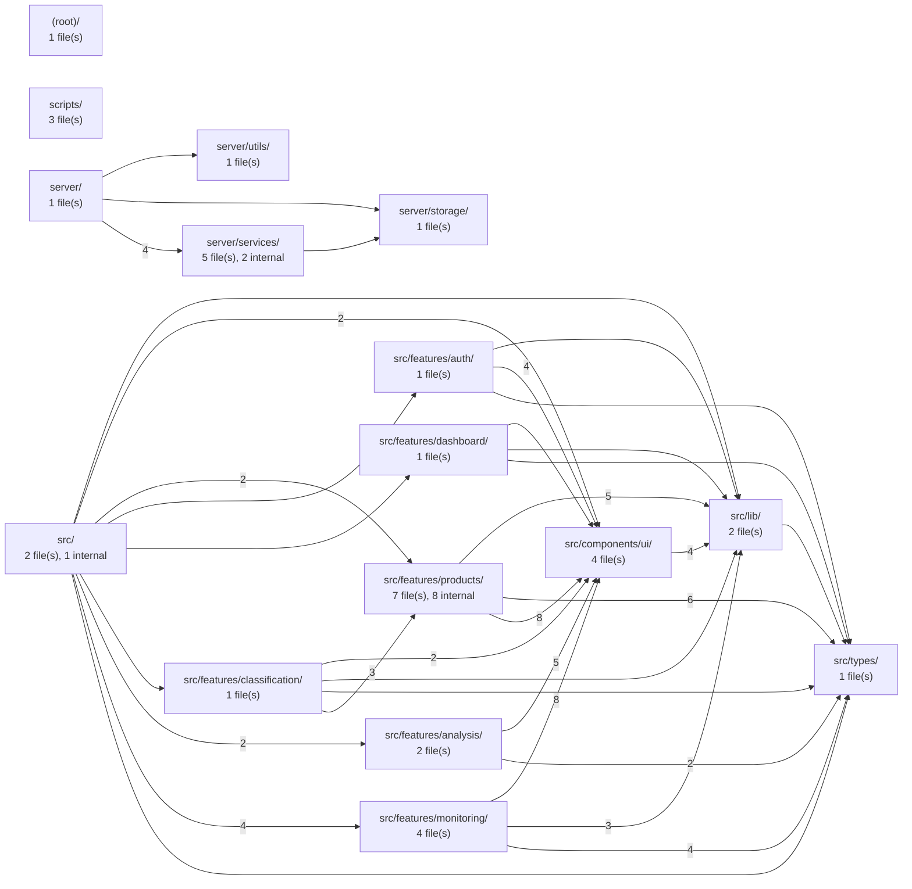

# Repository Code Graph

_Generated 2026-07-10T11:27:49.760Z from `graph.json`._

- **Root:** `D:/电商监控`
- **Files indexed:** 37
- **Import edges:** 95

---

## 1. Folder-level overview

Each box is a folder (module). Arrows are imports that cross folder boundaries; edge labels show how many file-to-file imports collapse into one arrow. Use this to see how the repo is split into modules and which ones depend on which.

## 2. File-level dependency graph

Each box is a source file, grouped by folder. Arrows are `import` / `require` relationships resolved to in-repo files. Colors flag the role each file plays.

```mermaid
graph LR
  subgraph n__root_["(root)/"]
    n_vite_config_ts["vite.config.ts"]
  end
  subgraph n_scripts["scripts/"]
    n_scripts_decode_dts_runtime_mjs["decode-dts-runtime.mjs"]
    n_scripts_inspect_dts_chunks_mjs["inspect-dts-chunks.mjs"]
    n_scripts_make_icon_mjs["make-icon.mjs"]
  end
  subgraph n_server["server/"]
    n_server_index_js["index.js"]
  end
  subgraph n_server_services["server/services/"]
    n_server_services_analysisService_js["analysisService.js"]
    n_server_services_authService_js["authService.js"]
    n_server_services_browserService_js["browserService.js"]
    n_server_services_monitorService_js["monitorService.js"]
    n_server_services_tmallScraper_js["tmallScraper.js"]
  end
  subgraph n_server_storage["server/storage/"]
    n_server_storage_db_js["db.js"]
  end
  subgraph n_server_utils["server/utils/"]
    n_server_utils_env_js["env.js"]
  end
  subgraph n_src["src/"]
    n_src_App_tsx["App.tsx"]
    n_src_main_tsx["main.tsx"]
  end
  subgraph n_src_components_ui["src/components/ui/"]
    n_src_components_ui_badge_tsx["badge.tsx"]
    n_src_components_ui_button_tsx["button.tsx"]
    n_src_components_ui_card_tsx["card.tsx"]
    n_src_components_ui_input_tsx["input.tsx"]
  end
  subgraph n_src_features_analysis["src/features/analysis/"]
    n_src_features_analysis_AnalysisPanel_tsx["AnalysisPanel.tsx"]
    n_src_features_analysis_ModelConfigPanel_tsx["ModelConfigPanel.tsx"]
  end
  subgraph n_src_features_auth["src/features/auth/"]
    n_src_features_auth_AuthPanel_tsx["AuthPanel.tsx"]
  end
  subgraph n_src_features_classification["src/features/classification/"]
    n_src_features_classification_MonitorClassification_tsx["MonitorClassification.tsx"]
  end
  subgraph n_src_features_dashboard["src/features/dashboard/"]
    n_src_features_dashboard_MetricCards_tsx["MetricCards.tsx"]
  end
  subgraph n_src_features_monitoring["src/features/monitoring/"]
    n_src_features_monitoring_DataRecords_tsx["DataRecords.tsx"]
    n_src_features_monitoring_MonitorSettings_tsx["MonitorSettings.tsx"]
    n_src_features_monitoring_RunLog_tsx["RunLog.tsx"]
    n_src_features_monitoring_SnapshotFeed_tsx["SnapshotFeed.tsx"]
  end
  subgraph n_src_features_products["src/features/products/"]
    n_src_features_products_DiscountDetailDialog_tsx["DiscountDetailDialog.tsx"]
    n_src_features_products_productDisplay_tsx["productDisplay.tsx"]
    n_src_features_products_productDisplayUtils_ts["productDisplayUtils.ts"]
    n_src_features_products_ProductForm_tsx["ProductForm.tsx"]
    n_src_features_products_ProductMonitorCard_tsx["ProductMonitorCard.tsx"]
    n_src_features_products_ProductTable_tsx["ProductTable.tsx"]
    n_src_features_products_SkuPriceTrend_tsx["SkuPriceTrend.tsx"]
  end
  subgraph n_src_lib["src/lib/"]
    n_src_lib_api_ts["api.ts"]
    n_src_lib_utils_ts["utils.ts"]
  end
  subgraph n_src_types["src/types/"]
    n_src_types_domain_ts["domain.ts"]
  end
  n_server_index_js --> n_server_utils_env_js
  n_server_index_js --> n_server_storage_db_js
  n_server_index_js --> n_server_services_analysisService_js
  n_server_index_js --> n_server_services_authService_js
  n_server_index_js --> n_server_services_monitorService_js
  n_server_index_js --> n_server_services_browserService_js
  n_server_services_monitorService_js --> n_server_storage_db_js
  n_server_services_monitorService_js --> n_server_services_tmallScraper_js
  n_server_services_tmallScraper_js --> n_server_services_browserService_js
  n_src_App_tsx --> n_src_lib_api_ts
  n_src_App_tsx --> n_src_components_ui_button_tsx
  n_src_App_tsx --> n_src_components_ui_badge_tsx
  n_src_App_tsx --> n_src_features_products_ProductForm_tsx
  n_src_App_tsx --> n_src_features_auth_AuthPanel_tsx
  n_src_App_tsx --> n_src_features_dashboard_MetricCards_tsx
  n_src_App_tsx --> n_src_features_products_ProductTable_tsx
  n_src_App_tsx --> n_src_features_classification_MonitorClassification_tsx
  n_src_App_tsx --> n_src_features_analysis_AnalysisPanel_tsx
  n_src_App_tsx --> n_src_features_analysis_ModelConfigPanel_tsx
  n_src_App_tsx --> n_src_features_monitoring_SnapshotFeed_tsx
  n_src_App_tsx --> n_src_features_monitoring_DataRecords_tsx
  n_src_App_tsx --> n_src_features_monitoring_MonitorSettings_tsx
  n_src_App_tsx --> n_src_features_monitoring_RunLog_tsx
  n_src_App_tsx --> n_src_types_domain_ts
  n_src_components_ui_badge_tsx --> n_src_lib_utils_ts
  n_src_components_ui_button_tsx --> n_src_lib_utils_ts
  n_src_components_ui_card_tsx --> n_src_lib_utils_ts
  n_src_components_ui_input_tsx --> n_src_lib_utils_ts
  n_src_features_analysis_AnalysisPanel_tsx --> n_src_components_ui_button_tsx
  n_src_features_analysis_AnalysisPanel_tsx --> n_src_components_ui_card_tsx
  n_src_features_analysis_AnalysisPanel_tsx --> n_src_types_domain_ts
  n_src_features_analysis_ModelConfigPanel_tsx --> n_src_components_ui_button_tsx
  n_src_features_analysis_ModelConfigPanel_tsx --> n_src_components_ui_card_tsx
  n_src_features_analysis_ModelConfigPanel_tsx --> n_src_components_ui_input_tsx
  n_src_features_analysis_ModelConfigPanel_tsx --> n_src_types_domain_ts
  n_src_features_auth_AuthPanel_tsx --> n_src_lib_api_ts
  n_src_features_auth_AuthPanel_tsx --> n_src_components_ui_button_tsx
  n_src_features_auth_AuthPanel_tsx --> n_src_components_ui_card_tsx
  n_src_features_auth_AuthPanel_tsx --> n_src_components_ui_input_tsx
  n_src_features_auth_AuthPanel_tsx --> n_src_components_ui_badge_tsx
  n_src_features_auth_AuthPanel_tsx --> n_src_types_domain_ts
  n_src_features_classification_MonitorClassification_tsx --> n_src_components_ui_badge_tsx
  n_src_features_classification_MonitorClassification_tsx --> n_src_components_ui_card_tsx
  n_src_features_classification_MonitorClassification_tsx --> n_src_lib_utils_ts
  n_src_features_classification_MonitorClassification_tsx --> n_src_types_domain_ts
  n_src_features_classification_MonitorClassification_tsx --> n_src_features_products_productDisplay_tsx
  n_src_features_classification_MonitorClassification_tsx --> n_src_features_products_ProductMonitorCard_tsx
  n_src_features_classification_MonitorClassification_tsx --> n_src_features_products_productDisplayUtils_ts
  n_src_features_dashboard_MetricCards_tsx --> n_src_components_ui_card_tsx
  n_src_features_dashboard_MetricCards_tsx --> n_src_lib_utils_ts
  n_src_features_dashboard_MetricCards_tsx --> n_src_types_domain_ts
  n_src_features_monitoring_DataRecords_tsx --> n_src_components_ui_button_tsx
  n_src_features_monitoring_DataRecords_tsx --> n_src_components_ui_card_tsx
  n_src_features_monitoring_DataRecords_tsx --> n_src_lib_utils_ts
  n_src_features_monitoring_DataRecords_tsx --> n_src_types_domain_ts
  n_src_features_monitoring_MonitorSettings_tsx --> n_src_components_ui_button_tsx
  n_src_features_monitoring_MonitorSettings_tsx --> n_src_components_ui_card_tsx
  n_src_features_monitoring_MonitorSettings_tsx --> n_src_components_ui_input_tsx
  n_src_features_monitoring_MonitorSettings_tsx --> n_src_types_domain_ts
  n_src_features_monitoring_RunLog_tsx --> n_src_components_ui_badge_tsx
  n_src_features_monitoring_RunLog_tsx --> n_src_components_ui_card_tsx
  n_src_features_monitoring_RunLog_tsx --> n_src_lib_utils_ts
  n_src_features_monitoring_RunLog_tsx --> n_src_types_domain_ts
  n_src_features_monitoring_SnapshotFeed_tsx --> n_src_components_ui_card_tsx
  n_src_features_monitoring_SnapshotFeed_tsx --> n_src_lib_utils_ts
  n_src_features_monitoring_SnapshotFeed_tsx --> n_src_types_domain_ts
  n_src_features_products_DiscountDetailDialog_tsx --> n_src_lib_utils_ts
  n_src_features_products_DiscountDetailDialog_tsx --> n_src_types_domain_ts
  n_src_features_products_DiscountDetailDialog_tsx --> n_src_features_products_productDisplayUtils_ts
  n_src_features_products_productDisplay_tsx --> n_src_components_ui_button_tsx
  n_src_features_products_productDisplay_tsx --> n_src_features_products_productDisplayUtils_ts
  n_src_features_products_productDisplayUtils_ts --> n_src_lib_utils_ts
  n_src_features_products_productDisplayUtils_ts --> n_src_types_domain_ts
  n_src_features_products_ProductForm_tsx --> n_src_components_ui_button_tsx
  n_src_features_products_ProductForm_tsx --> n_src_components_ui_card_tsx
  n_src_features_products_ProductForm_tsx --> n_src_components_ui_input_tsx
  n_src_features_products_ProductForm_tsx --> n_src_types_domain_ts
  n_src_features_products_ProductMonitorCard_tsx --> n_src_components_ui_badge_tsx
  n_src_features_products_ProductMonitorCard_tsx --> n_src_components_ui_button_tsx
  n_src_features_products_ProductMonitorCard_tsx --> n_src_lib_api_ts
  n_src_features_products_ProductMonitorCard_tsx --> n_src_lib_utils_ts
  n_src_features_products_ProductMonitorCard_tsx --> n_src_types_domain_ts
  n_src_features_products_ProductMonitorCard_tsx --> n_src_features_products_productDisplay_tsx
  n_src_features_products_ProductMonitorCard_tsx --> n_src_features_products_DiscountDetailDialog_tsx
  n_src_features_products_ProductMonitorCard_tsx --> n_src_features_products_productDisplayUtils_ts
  n_src_features_products_ProductMonitorCard_tsx --> n_src_features_products_SkuPriceTrend_tsx
  n_src_features_products_ProductTable_tsx --> n_src_components_ui_card_tsx
  n_src_features_products_ProductTable_tsx --> n_src_components_ui_badge_tsx
  n_src_features_products_ProductTable_tsx --> n_src_types_domain_ts
  n_src_features_products_ProductTable_tsx --> n_src_features_products_productDisplay_tsx
  n_src_features_products_ProductTable_tsx --> n_src_features_products_ProductMonitorCard_tsx
  n_src_features_products_SkuPriceTrend_tsx --> n_src_lib_utils_ts
  n_src_features_products_SkuPriceTrend_tsx --> n_src_types_domain_ts
  n_src_lib_api_ts --> n_src_types_domain_ts
  n_src_main_tsx --> n_src_App_tsx
  classDef hub    fill:#fef3c7,stroke:#b45309,color:#111;
  classDef entry  fill:#dbeafe,stroke:#1d4ed8,color:#111;
  classDef orphan fill:#f3f4f6,stroke:#6b7280,color:#374151;
  class n_src_components_ui_badge_tsx,n_src_components_ui_button_tsx,n_src_components_ui_card_tsx,n_src_components_ui_input_tsx,n_src_features_products_productDisplay_tsx,n_src_features_products_productDisplayUtils_ts,n_src_lib_api_ts,n_src_lib_utils_ts,n_src_types_domain_ts hub;
  class n_server_index_js,n_src_main_tsx entry;
  class n_scripts_decode_dts_runtime_mjs,n_scripts_inspect_dts_chunks_mjs,n_scripts_make_icon_mjs,n_vite_config_ts orphan;
```

**Legend:** 🟨 hub (imported by ≥3 files) · 🟦 entry point (nothing imports it) · ⬜ orphan (no import edges).

## 3. What each file does

Keywords are inferred from filename + indexed body tokens (framework noise and hex/UUID fragments filtered out). They are a hint, not documentation. `Imports out` = files this one depends on. `Imported by` = files that depend on it.

| File                                                    | Folder                        | Keywords (inferred purpose)                                    | Imports out | Imported by |
| ------------------------------------------------------- | ----------------------------- | -------------------------------------------------------------- | ----------- | ----------- |
| `scripts/decode-dts-runtime.mjs`                        | `scripts`                     | decode, dts, runtime, node, runtimeurl                         | 0           | 0           |
| `scripts/inspect-dts-chunks.mjs`                        | `scripts`                     | inspect, dts, chunks, urls, assets                             | 0           | 0           |
| `scripts/make-icon.mjs`                                 | `scripts`                     | make, icon, node, path, fileurltopath                          | 0           | 0           |
| `server/index.js`                                       | `server`                      | index, express, cors, zod, jszip                               | 6           | 0           |
| `server/services/analysisService.js`                    | `server/services`             | analysis, service, buildruleinsights, products, snapshots      | 0           | 1           |
| `server/services/authService.js`                        | `server/services`             | auth, service, crypto, node, buildtaobaooauthurl               | 0           | 1           |
| `server/services/browserService.js`                     | `server/services`             | browser, service, node, path, spawn                            | 0           | 2           |
| `server/services/monitorService.js`                     | `server/services`             | monitor, service, newid, readdb, updatedb                      | 2           | 1           |
| `server/services/tmallScraper.js`                       | `server/services`             | tmall, scraper, cheerio, crypto, node                          | 1           | 1           |
| `server/storage/db.js`                                  | `server/storage`              | node, promises, path, fileurltopath, __dirname                 | 0           | 2           |
| `server/utils/env.js`                                   | `server/utils`                | env, node, path, loadenv, envpath                              | 0           | 1           |
| `src/App.tsx`                                           | `src`                         | useeffect, usestate, react, barchart3, bell                    | 15          | 1           |
| `src/components/ui/badge.tsx`                           | `src/components/ui`           | badge, htmlattributes, react, lib, utils                       | 1           | 6           |
| `src/components/ui/button.tsx`                          | `src/components/ui`           | button, buttonhtmlattributes, react, lib, utils                | 1           | 9           |
| `src/components/ui/card.tsx`                            | `src/components/ui`           | card, htmlattributes, react, lib, utils                        | 1           | 11          |
| `src/components/ui/input.tsx`                           | `src/components/ui`           | input, inputhtmlattributes, textareahtmlattributes, react, lib | 1           | 4           |
| `src/features/analysis/AnalysisPanel.tsx`               | `src/features/analysis`       | analysis, panel, braincircuit, wandsparkles, lucide            | 3           | 1           |
| `src/features/analysis/ModelConfigPanel.tsx`            | `src/features/analysis`       | model, panel, usestate, react, keyround                        | 4           | 1           |
| `src/features/auth/AuthPanel.tsx`                       | `src/features/auth`           | auth, panel, useeffect, useref, usestate                       | 6           | 1           |
| `src/features/classification/MonitorClassification.tsx` | `src/features/classification` | monitor, classification, useeffect, usememo, usestate          | 7           | 1           |
| `src/features/dashboard/MetricCards.tsx`                | `src/features/dashboard`      | metric, cards, alerttriangle, image, packagesearch             | 3           | 1           |
| `src/features/monitoring/DataRecords.tsx`               | `src/features/monitoring`     | data, records, download, trash2, lucide                        | 4           | 1           |
| `src/features/monitoring/MonitorSettings.tsx`           | `src/features/monitoring`     | monitor, usestate, react, pausecircle, playcircle              | 4           | 1           |
| `src/features/monitoring/RunLog.tsx`                    | `src/features/monitoring`     | run, activity, checkcircle2, clock, xcircle                    | 4           | 1           |
| `src/features/monitoring/SnapshotFeed.tsx`              | `src/features/monitoring`     | snapshot, feed, images, lucide, react                          | 3           | 1           |
| `src/features/products/DiscountDetailDialog.tsx`        | `src/features/products`       | discount, detail, dialog, receipttext, lucide                  | 3           | 1           |
| `src/features/products/productDisplay.tsx`              | `src/features/products`       | product, display, download, play, store                        | 2           | 3           |
| `src/features/products/productDisplayUtils.ts`          | `src/features/products`       | product, display, utils, currency, lib                         | 2           | 4           |
| `src/features/products/ProductForm.tsx`                 | `src/features/products`       | product, form, usestate, react, crown                          | 4           | 1           |
| `src/features/products/ProductMonitorCard.tsx`          | `src/features/products`       | product, monitor, card, check, coins                           | 9           | 2           |
| `src/features/products/ProductTable.tsx`                | `src/features/products`       | product, table, useeffect, usestate, react                     | 5           | 1           |
| `src/features/products/SkuPriceTrend.tsx`               | `src/features/products`       | sku, price, trend, useeffect, usememo                          | 2           | 1           |
| `src/lib/api.ts`                                        | `src/lib`                     | api, analysis, authsession, overview, product                  | 1           | 3           |
| `src/lib/utils.ts`                                      | `src/lib`                     | utils, clsx, classvalue, twmerge, tailwind                     | 0           | 13          |
| `src/main.tsx`                                          | `src`                         | main, strictmode, react, createroot, dom                       | 1           | 0           |
| `src/types/domain.ts`                                   | `src/types`                   | domain, product, name, shopname, shoplogo                      | 0           | 17          |
| `vite.config.ts`                                        | `(root)`                      | vite, defineconfig, react, vitejs, plugin                      | 0           | 0           |

## 4. Standalone files (no import edges)

These files were indexed but neither import another in-repo file nor get imported. They are often entry points, scripts, or candidates for cleanup.

- `scripts/decode-dts-runtime.mjs`
- `scripts/inspect-dts-chunks.mjs`
- `scripts/make-icon.mjs`
- `vite.config.ts`

---
_Regenerate with: `node analyze.js && node visualize.js`._
