# 经营罗盘

经营罗盘是一款面向淘宝/天猫运营的本地商品监控与经营数据工作台。桌面端负责账号浏览器、SKU 价格核验、素材抓取、AI 创作和本地运营分析；开源团队网页版负责多人共享经营报表、店铺权限、邀请码和设备授权。Windows、macOS Intel 与 macOS Apple Silicon 均提供安装包。

## 下载与说明

- [下载最新版安装包](https://github.com/PMZPZM0/ecom-competitor-monitor/releases/latest)
- [查看完整中文使用说明](docs/USER_GUIDE.md)
- Windows：选择文件名包含 `win-x64.exe` 的安装包。
- Intel 芯片 Mac：选择文件名包含 `mac-x64.dmg` 的安装包。
- Apple M 系列芯片 Mac：选择文件名包含 `mac-arm64.dmg` 的安装包。

> macOS 安装包已完成 ad-hoc 完整性签名，但未使用 Apple Developer ID 公证。首次启动请右键应用选择“打开”；若仍被拦截，请到“系统设置 > 隐私与安全性”点击“仍要打开”。详见[使用说明](docs/USER_GUIDE.md#macos-首次打开提示无法验证开发者)。

## 产品形态

| 形态 | 适合谁 | 主要能力 | 数据边界 |
| --- | --- | --- | --- |
| 桌面端 / 本机网页 | 运营个人、商品监控与 AI 创作 | 商品与 SKU 抓价、账号授权、飞书提醒、素材下载、QwenPaw Agent、运营数据导入与分析 | 淘宝登录、Cookie、价格证据、飞书配置、模型 Key 和 QwenPaw 都只保存在本机 |
| 团队网页版 | 团队管理员、老板和共享查看人员 | 共享运营报表、店铺团队、成员权限、邀请码、设备授权、整店/品类/单品数据看板 | 只保存管理员上传的运营报表和团队治理数据，不接触淘宝账号或本机密钥 |

## 团队网页版主要功能

- 账号与团队：QQ 邮箱 + 团队邀请码免验证码注册，支持账号密码登录、主动退出团队、解散团队和在已加入团队间切换。
- 店铺权限：一个店铺对应一个独立团队；管理员按成员逐个授权可查看店铺，成员只会看到获授权的数据。
- 团队治理：成员备注、团队管理员、人数上限、默认 2 GB 云空间、邀请码人数上限、设备上限、设备撤销和完整审计记录。
- 平台治理：超级管理员可以开关自助创建团队、创建/编辑/封禁/恢复/永久删除团队，并调整团队人数与存储额度；普通成员不会看到平台管理功能。
- 数据工作台：整店总览、品类 360、商品排行和数据仓库分别一屏展示，支持店铺、日期、品类、型号和商品 ID 筛选。
- 报表管理：支持日/周/月/自定义周期、日期自动识别后人工修正、预览导入、按统计日期折叠、批量选择、删除和店铺归属调整。
- 商品资料：按“店铺 + 商品 ID”维护型号与品类，支持模板下载、Excel 导入、手工新增、重复拦截、筛选和导出。
- 统一口径：净 GSV = 支付金额 - 成功退款金额；推广类型整体费率 = 类型总花费 / 关联商品净 GSV；计划费率 = 计划花费 / 计划推广成交金额。
- 开源部署：提供 Docker Compose、Node.js + systemd、Caddy 反向代理示例和自动化接口测试，可部署到自己的服务器与域名。

## 桌面端与团队网页版联动

1. 团队管理员部署或打开团队网页版，在“团队管理 > 同步授权码”中为指定店铺创建设备授权码。
2. 同事在桌面端的“运营数据 > 数据仓库 > 云端团队数据”输入团队地址和授权码，绑定当前电脑。
3. 点击“立即同步”后，云端仅下发该设备获授权店铺的运营报表；桌面端保留本地上传数据，并按云端来源去重。

同步是单向的“团队云端报表 → 本机分析工作台”。商品抓价、账号登录、浏览器资料、价格证据、飞书凭证和模型配置不会上传到团队网页。团队管理员可以随时撤销授权码或移除设备；桌面端断开连接后，本机已有数据不会被删除。

团队网页版完整源码和部署说明在 [cloud-data-hub](cloud-data-hub/README.md)。

## v1.0.35

- 品牌统一为“经营罗盘”：桌面窗口、安装器、快捷方式、托盘、使用说明、GitHub Release 和团队网页版使用同一名称。
- 正式开源 `cloud-data-hub/` 团队网页版，包含账号、团队、店铺、成员、邀请码、设备授权、平台管理、报表工作台与自部署配置。
- 桌面端增加团队云端授权码绑定和手动同步；只读取获授权店铺的报表，本地上传继续保留并按来源去重。
- 重做运营数据工作台：整店总览、品类 360、商品排行、数据仓库分屏展示，补齐日期、店铺、品类、型号、商品 ID 筛选与组合趋势。
- 扩展报表数据库：支持日/周/月/自定义周期、自动识别日期后人工修正、统计日期折叠、批量选择删除、店铺归属和商品资料维护。
- 统一桌面端与网页端指标核心：净 GSV = 支付金额 - 成功退款金额；推广类型整体费率 = 类型总花费 / 关联商品净 GSV；计划费率 = 计划花费 / 计划推广成交金额。
- 推广明细按推广类型和计划展开，全站推广、关键词推广及后续新类型独立汇总；外层展示整体费率，内层展示各计划花费、成交、ROI 与计划费率。
- 完善团队权限：成员备注、团队切换、逐成员店铺授权、团队人数与设备上限、邀请码容量、团队封禁/恢复/解散/永久删除以及自助创建开关。
- 修复多 SKU 部分缺货误报账号异常、型号识别不稳定、批量抓取旧卡片跟随加载、主 SKU 展示和删除/展开卡顿。
- 修复桌面源码快捷方式、托盘图标、打包共享模块和窗口标题，Windows 开发源码版与安装版均可正常启动。
- 全量自动化测试覆盖价格证据边界、账号与价格渠道隔离、运营公式一致性、云同步、团队权限、文件导入和桌面启动。

## 界面预览

以下截图来自最新版真实界面。商品图片、店铺、商品名、商品 ID、SKU、型号、价格、库存、账号备注、用户分组和飞书业务内容均已使用不可还原的马赛克脱敏，仓库不保存未脱敏原图。

| 监控总览 | 商品抓取工作台 |
| --- | --- |
| 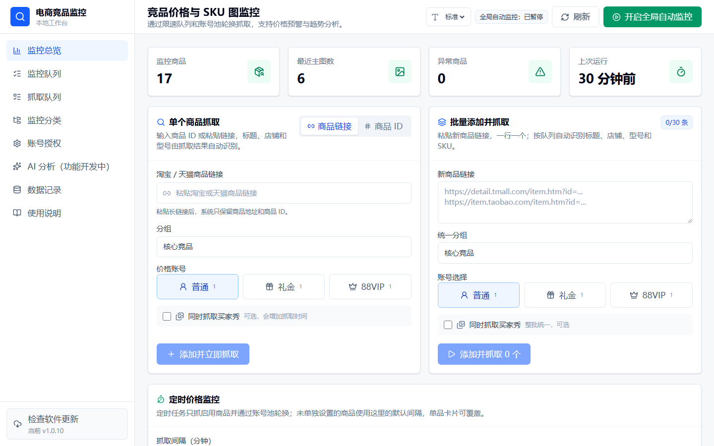 | 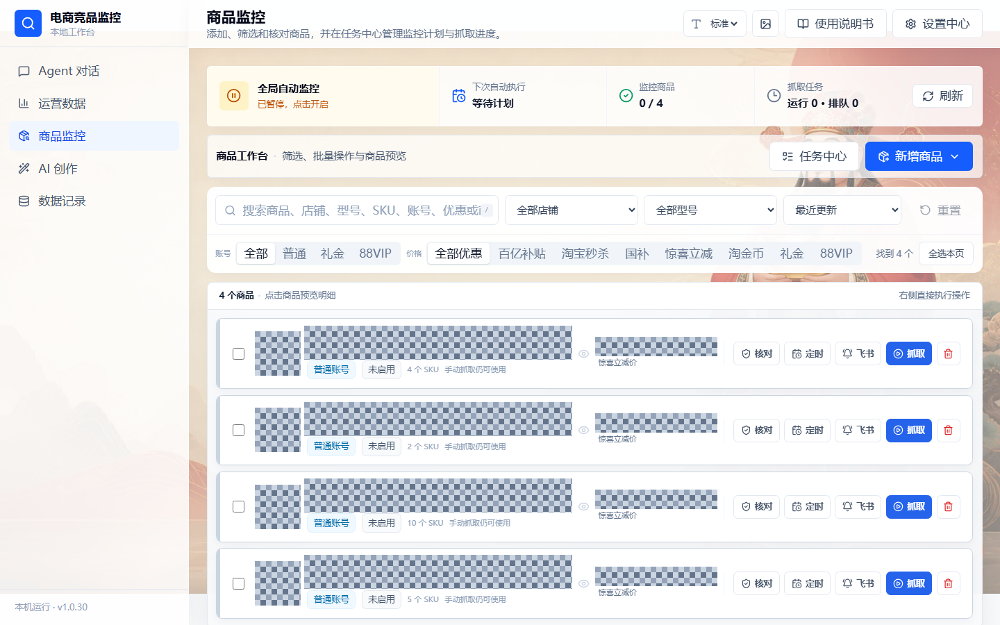 |

| SKU 监控概览 | SKU 价格趋势 |
| --- | --- |
| 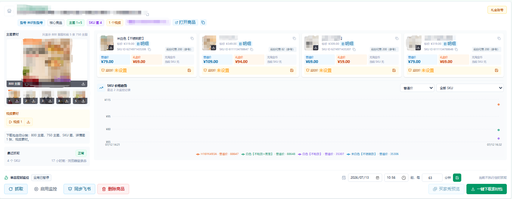 | 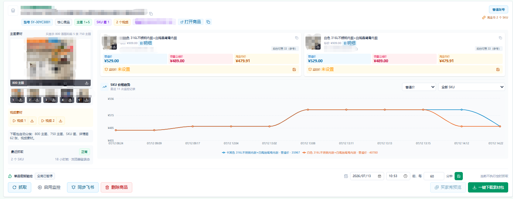 |

| SKU 优惠明细 | 已监控商品队列 |
| --- | --- |
| 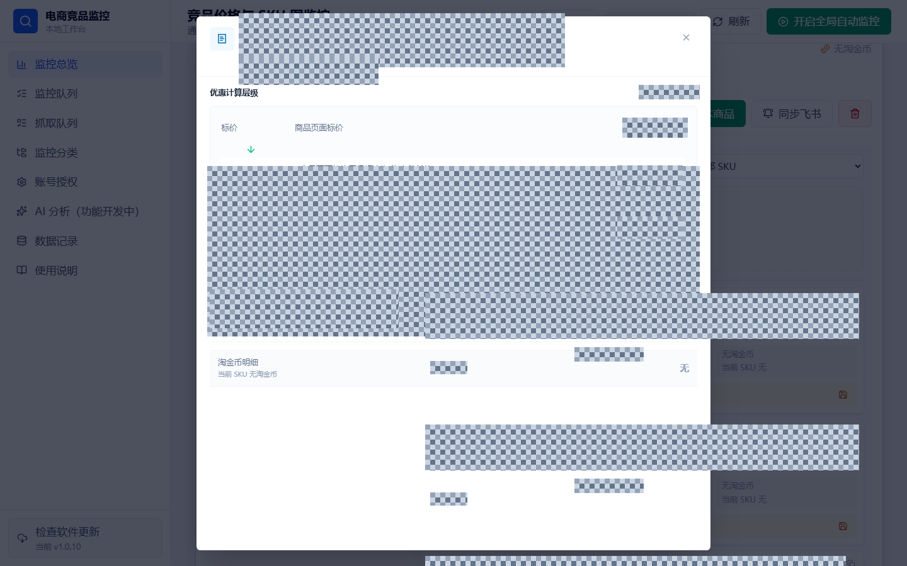 | 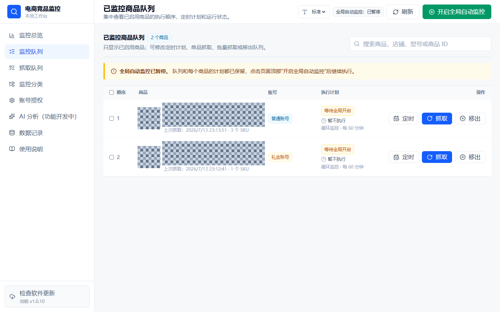 |

| 抓取任务队列 | 店铺与型号分类 |
| --- | --- |
| 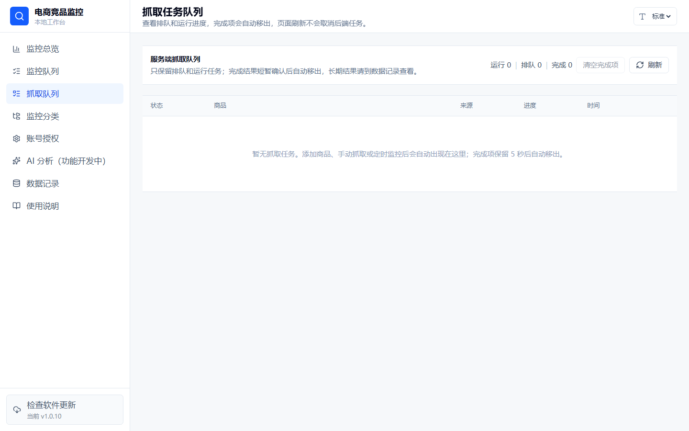 | 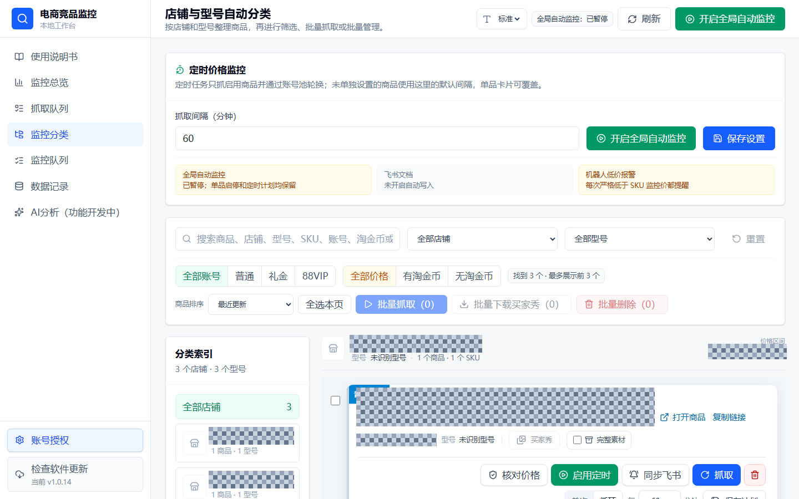 |

| 淘宝账号授权 | 飞书文档与机器人提醒 |
| --- | --- |
| 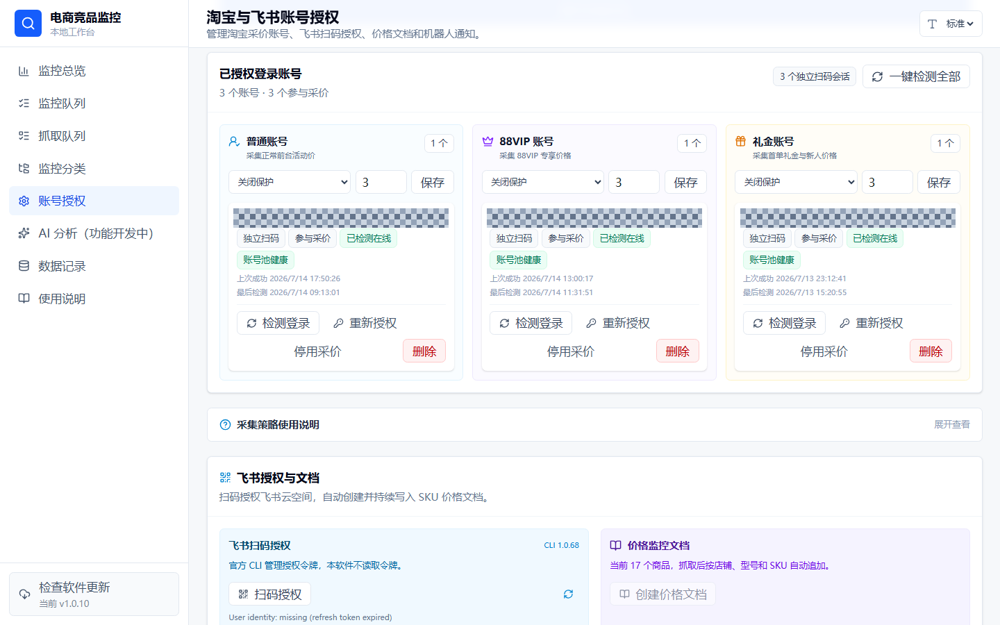 | 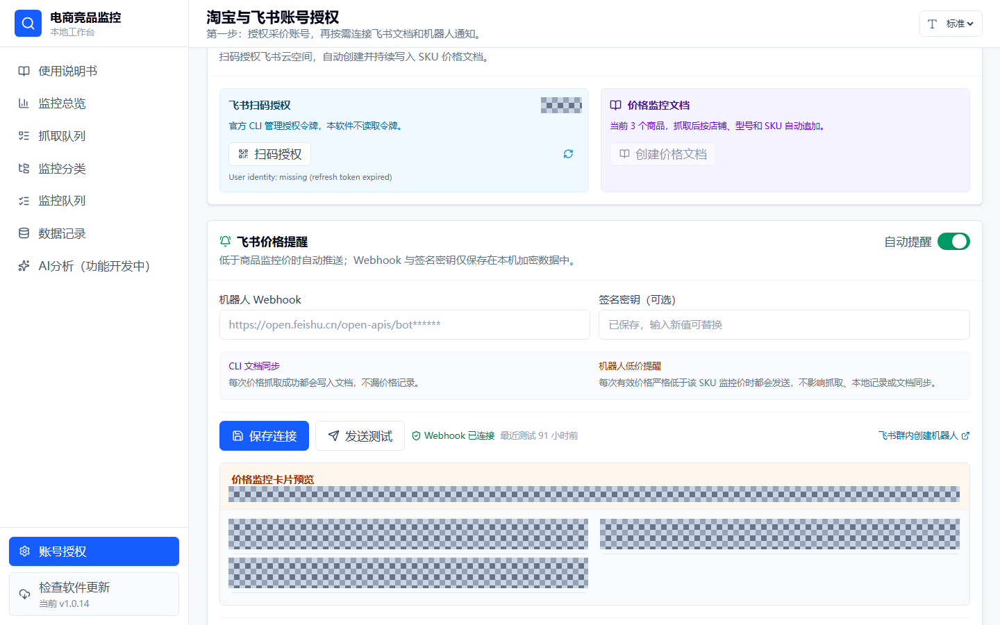 |

| 软件内使用说明 | 版本更新与加速下载 |
| --- | --- |
| 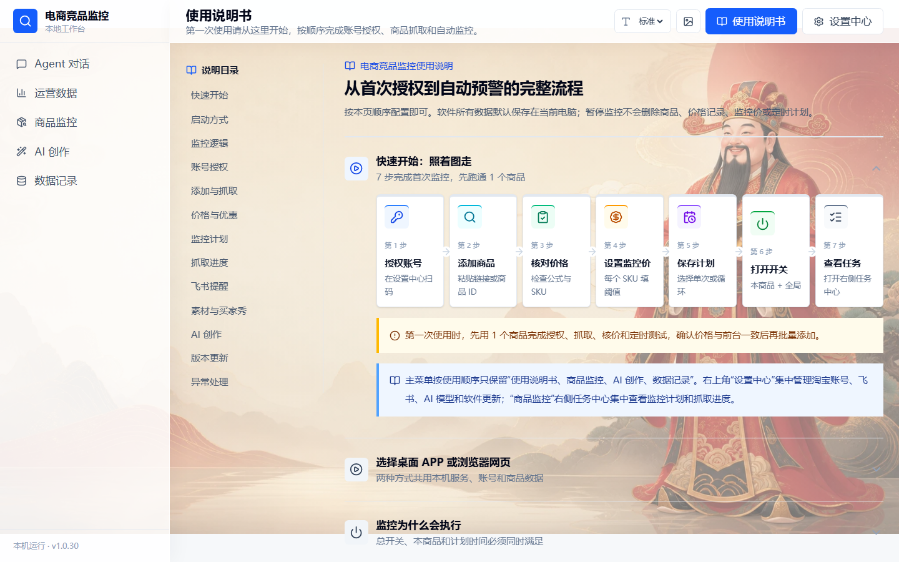 | 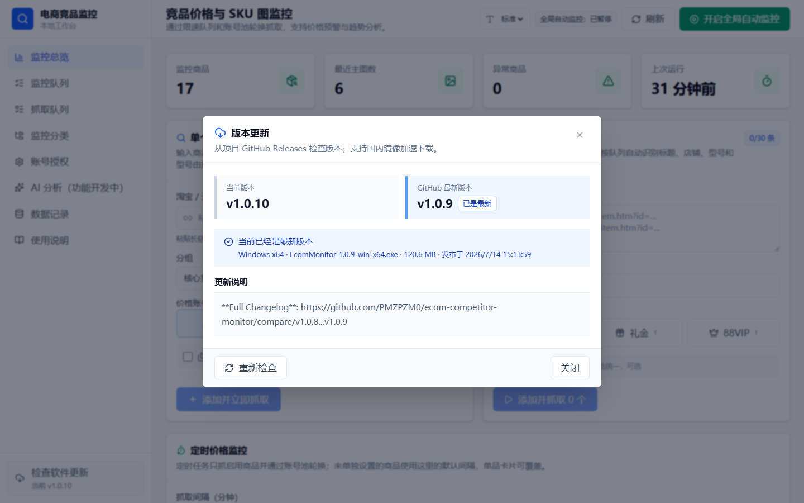 |

## 主要功能

- 商品录入：支持淘宝/天猫长链接、自动精简链接、纯商品 ID 和最多 30 条批量添加；单个/批量均可按需勾选买家秀。
- 双启动方式：首次启动可选择桌面 APP 或本机浏览器网页并记住选择，系统托盘支持随时切换、清除选择和退出。
- 账号池：普通、礼金、88VIP 账号使用独立浏览器目录，支持扫码授权、在线检测和重新授权；每种账号都会采集其页面可见的全部公共价格，礼金和 88VIP 再保留各自真实权益价，不要求另有普通账号。
- 账号视角：多账号抓取结果完全隔离；日常价格任务只使用商品指定的主账号类型，最多尝试 2 个同类型账号，禁止跨普通、礼金、88VIP 类型静默回退。非主账号视角只读，必须由用户显式刷新，不参与监控或飞书提醒。
- 价格核验：按 SKU 独立解析标价、普通价、淘宝秒杀价、国补价、惊喜立减价、淘金币价、礼金价和 88VIP 价，保留证据、状态和计算公式；证据不足时标记未验证，不保存猜测价。
- 价格监控：每个 SKU 独立设置监控价和口径，可选 `lowest`、`normal`、`government`、`surprise`、`gift`、`vip88`、`coin`；旧结果只显示“上次已验证”，不参与告警。自动任务在每天 08:00、11:00、14:00、17:00、20:00、23:00 六个窗口内分散执行。
- 素材下载：800 主图、前 5 张 750 主图、SKU 图、详情图和真实视频分类打包，支持单项下载。
- 买家秀：默认不随商品抓取，可按需开启；支持图片、视频和文案预览，整包/单条/批量下载、单独重试和历史有效缓存。
- 分类管理：按店铺与型号归档，支持搜索、筛选、排序、批量抓取、批量下载和批量删除。
- 飞书联动：内置官方 `@larksuite/cli`，支持扫码授权、主账号视角价格文档同步和群机器人低价提醒；机器人仅在首次跌破监控价、继续创下新低、或恢复后再次跌破时提醒，发送失败进入持久出站队列重试。
- 运行反馈：抓取、监控、飞书同步和下载任务均显示进行中、完成或失败原因。
- 运营 Agent：基于 [QwenPaw](https://github.com/agentscope-ai/QwenPaw) 的本地流式会话，连接本应用提供的运营数据与受控工具，可分析商品、店铺、类目、人群和推广报表，并结合每位运营维护的“运营思路”给出有依据的建议。首次使用会从 QwenPaw 官方下载服务安装带完整 Python/Node 依赖的桌面运行时，Windows 默认安装到 `D:\电商监控数据\QwenPaw`，自定义路径会被后续更新复用；模型请求只使用用户自行配置的接口。
- AI 创作：提示词与生图合并为一个主入口。商品生图需上传 1～3 张产品参考图，自由生图可不传参考图；用户只写一句需求，AI 会在后台整理提示词并自动加入可恢复的生图队列，支持一次生成 1/2/4 张、1K 标准与 2K/4K 本机增强输出。
- 图片工作流：生成结果自动进入历史与收藏相册，支持下载、删除、参数复用、基于此图继续创作、非破坏式框选/点选批注和 Photoshop 往返编辑；需要逐项控制时可从 AI 创作进入“专业提示词”，同步回来后由用户确认再提交。
- 模型配置：提供“稳定通道 / 高速通道”和高级设置中的自定义 OpenAI 兼容接口。每位同事在自己的本机安装中配置自己的 Key，各通道独立加密保存；默认使用 `gpt-image-2` 与 `gpt-5.5`，自定义通道可另填模型，并可分别测试提示词与生图连接。
- 新手引导：菜单按启用顺序排列，首次打开进入图形化 7 步流程，步骤卡可直接跳转到对应功能，详细说明按需展开。
- 抓取队列：价格、买家秀、完整素材使用三条互不覆盖数据的持久 FIFO 队列；刷新或重启后恢复，待授权任务在账号恢复后可继续，临时失败只重试失败商品，间隔为 1、5、15 分钟。
- 证据审计：成功证据保留 7 天、失败证据保留 30 天，总量上限 10 GB；新价格引擎必须完成 10 个连续无异常的影子核验轮次，才标记为可启用。
- 软件更新：启动或回到前台时主动检查并提醒，按当前系统选择安装包，支持国内镜像加速下载和 SHA-256 核对。
- 本地数据：商品、价格记录、账号浏览器目录和飞书配置默认保存在当前电脑。

## 本地开发

要求 Node.js 20 或更高版本，并安装 Chrome 或 Edge。

```bash
npm install
npm run dev
```

前端默认地址：`http://localhost:5173`  
后端默认地址：`http://localhost:4317`

常用命令：

```bash
npm test
npm run lint
npm run build
npm run screenshots:docs
```

`npm install` 会安装项目依赖及官方飞书 CLI。`screenshots:docs` 从当前本地界面生成文档截图，只写入脱敏后的 PNG；需要脱敏的页面如果没有识别到遮挡区域，脚本会直接失败。

## 项目结构

```text
electron/                  # Windows/macOS 桌面容器
server/
  index.js                 # Express API 入口
  services/
    browserService.js      # 独立账号浏览器与扫码登录
    tmallScraper.js        # 商品、素材、价格与买家秀采集
    priceResolver.js       # 分账号价格证据与计算
    monitorService.js      # 单次/六窗口监控调度
    feishuService.js       # 飞书机器人消息
    larkCliService.js      # 飞书扫码授权与文档同步
    modelConfigService.js  # 模型地址、密钥与连接测试
    imageGenerationService.js # GPT Image 兼容生图请求
    operationsAssistantService.js # QwenPaw 运营 Agent 本地运行时与业务适配
    updateService.js       # GitHub Release 与加速下载
  storage/                 # 本地数据读写
src/
  features/                # 授权、商品、监控、分类、说明、更新界面
  components/ui/           # 通用 UI 组件
scripts/                   # 文档截图等维护脚本
docs/                      # 使用说明和脱敏截图
cloud-data-hub/            # 可独立部署的团队网页版、Docker 与运维说明
```

## 环境变量

复制 `.env.example` 为 `.env` 后按需设置：

- `PORT` / `VITE_API_BASE`：本地服务地址。
- `FEISHU_CONFIG_KEY`：本地加密飞书 Webhook 与签名密钥，建议配置并保持不变。
- `TAOBAO_APP_KEY` / `TAOBAO_APP_SECRET` / `TAOBAO_REDIRECT_URI`：可选淘宝开放平台 OAuth 参数。
- `MODEL_STABLE_API_KEY` / `MODEL_FAST_API_KEY`：可选的稳定、高速通道默认 Key，界面保存值优先。
- `OPENAI_API_KEY` / `OPENAI_BASE_URL`：自定义通道的可选默认配置，不会发送到稳定或高速通道。
- `OPENAI_IMAGE_MODEL` / `OPENAI_MODEL`：分别指定生图模型和分析模型。
- `MODEL_CONFIG_ENCRYPTION_KEY`：本机模型 API Key 的加密密钥，建议配置后保持不变。

模型 Key 环境变量只适合单人本地开发或自用部署。对外分发安装包时不要在 `.env` 或安装包中内置任何 Key；每位同事应在自己电脑的“AI 创作 > 设置”中单独配置。

QwenPaw 官方当前提供 Windows x64 与 Apple Silicon 运行时；macOS Intel 版竞品监控应用仍可使用，但在 QwenPaw 官网提供 Intel 包之前不能自动安装运营 Agent。应用会明确提示架构不支持，不会把 Apple Silicon 包安装到 Intel Mac。

## 使用边界

淘宝/天猫页面可能因账号、地区、活动、登录验证和动态渲染返回不同结果。应用只保存有明确页面证据的价格，不把标价猜成普通价或账号专享价，也不会绕过平台验证码和安全验证。

正常抓取只需输入商品链接或 ID：应用使用已扫码授权的账号浏览器在后台打开商品页，收集该页面已经加载的数据，删除登录凭据后原子写入本机文件，再从磁盘重新读取并解析。浏览器账号路径不会再由 Node 后端额外请求淘宝详情或评价接口。该流程仍会真实访问商品页面，不代表可以规避平台风控；遇到验证码或安全验证时会停止并提示用户处理。手动粘贴/选择文件仅作为已有数据时的高级备用。

## 开源许可

本项目采用 [MIT License](LICENSE)。运营 Agent 参考并按需集成 [agentscope-ai/QwenPaw](https://github.com/agentscope-ai/QwenPaw)，QwenPaw 由 The QwenPaw Authors 以 [Apache License 2.0](https://github.com/agentscope-ai/QwenPaw/blob/main/LICENSE) 发布；本项目与 QwenPaw 上游项目相互独立，详细归属见[第三方开源声明](THIRD_PARTY_NOTICES.md)。
