# 电商竞品监控使用说明书

本文面向第一次使用本软件的同事，按顺序完成安装、账号授权、商品抓取、价格监控和飞书提醒。

软件内也常驻“使用说明”页面，可在左侧菜单随时打开，不需要离开当前应用。

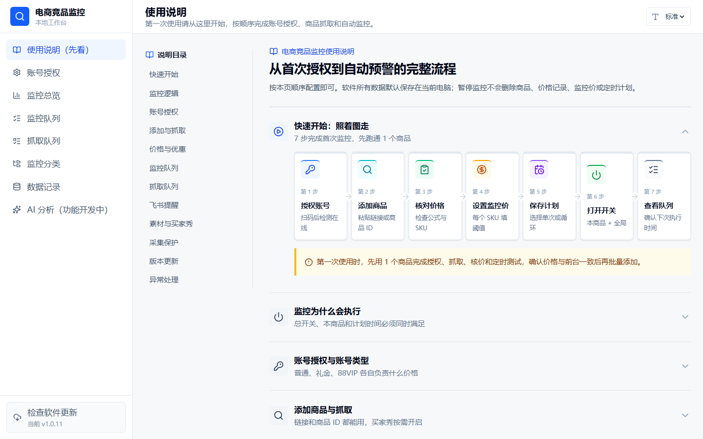

## 一、完整使用流程

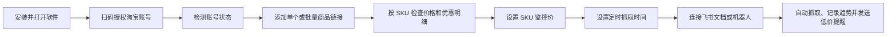

## 二、安装软件

在 GitHub Releases 的 Latest Release 下载对应系统的最新安装包：

- Windows：文件名包含 `Windows-x64.exe`。
- Intel 芯片 Mac：文件名包含 `macOS-Intel.dmg`。
- Apple M1/M2/M3/M4 芯片 Mac：文件名包含 `macOS-AppleSilicon.dmg`。

macOS 版本目前没有 Apple 开发者签名。若系统提示无法验证开发者，请在“系统设置 → 隐私与安全性”中选择“仍要打开”，或者在应用图标上右键选择“打开”。

每台电脑的数据独立保存。安装包不会携带开发者的商品、账号、Cookie、Webhook 或浏览器登录资料。

## 三、首次授权淘宝账号

1. 打开左侧“账号授权”。
2. 选择账号类型：普通账号、礼金账号或 88VIP 账号。
3. 填写容易识别的账号备注。
4. 点击“打开扫码登录”，使用淘宝 App 扫码。
5. 登录完成后返回软件，点击“检测登录”。
6. 状态显示“已检测在线”后，账号才会参与采价。

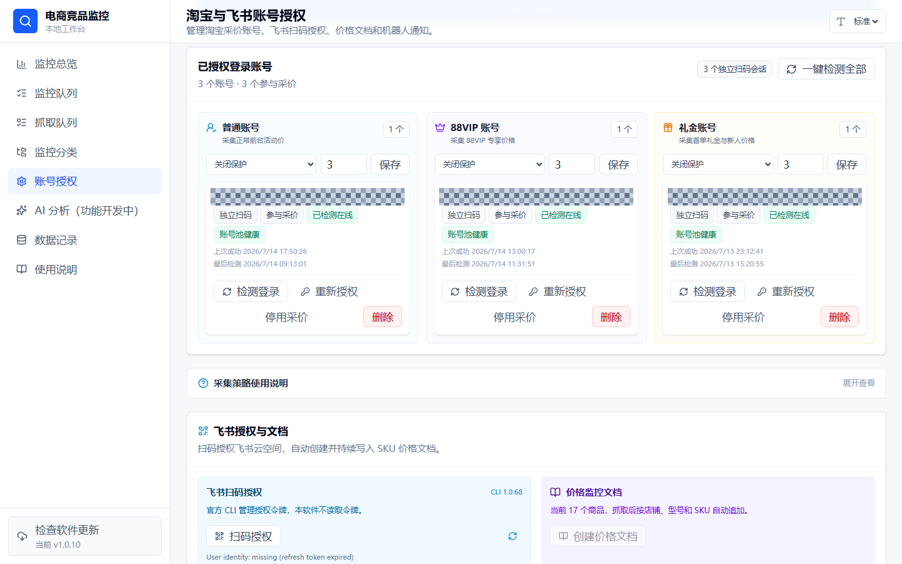

建议每种价格使用对应账号池：

- 普通账号：采集普通价、淘宝秒杀价、惊喜立减价和淘金币价。
- 礼金账号：采集首单礼金或新人专享价格。
- 88VIP 账号：采集 88VIP 专享价格。

礼金和 88VIP 商品会同时使用普通账号取得同一 SKU 的普通价基准，再与对应账号的前台价独立对比。没有普通账号基准或页面没有返回可信优惠依据时，软件会显示“未获取”，不会把标价猜成普通价、礼金价或 88VIP 价。普通账号掉线会导致礼金/88VIP 抓取被拒绝保存，请先重新授权普通账号。

账号掉线时点击“重新授权”。“一键检测全部”会检查账号池中所有账号，不会开始商品抓取。

“采集保护时间”只是本软件的访问间隔，不代表淘宝账号被风控。需要连续测试时可以关闭保护，长期自动监控建议保留合理间隔。

## 四、添加和抓取商品

### 单个商品

1. 打开“监控总览”。
2. 使用“商品链接”时，粘贴淘宝或天猫长链接；软件会自动清理跟踪参数。
3. 使用“商品 ID”时，只输入纯数字 ID 并选择淘宝或天猫，地址前缀会自动补全。
4. 分组和商品简称均为可选；成功抓取后优先展示平台真实标题、店铺和型号。
5. 选择参与采价的账号类型；需要买家秀时再勾选“同时抓取买家秀”。
6. 点击“添加并立即抓取”。

软件会自动清理链接中的无用跟踪参数，只保留有效商品地址。

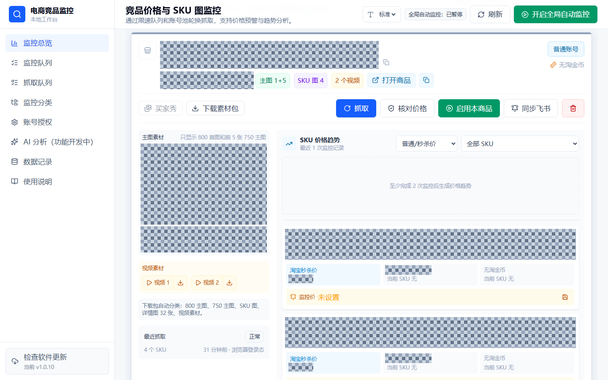

### 批量商品

1. 在“批量添加并抓取”中一行粘贴一个新商品链接。
2. 一次最多添加 30 条链接。
3. “同时抓取买家秀”对本批商品统一生效，默认关闭。
4. 点击批量抓取后，最多 5 个商品并行，其余商品按顺序排队。
5. 批量功能用于添加新链接，不会重复抓取已经存在的商品。

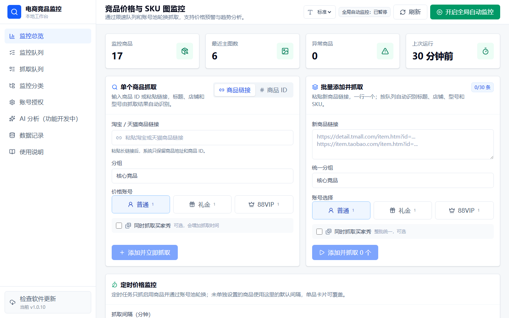

## 五、查看商品和 SKU 数据

抓取完成后，商品卡片会展示：

- 800 主图和前 5 张 750 主图。
- 真实存在的视频素材。
- SKU 图片、SKU 名称和前台可售库存参考。
- 标价、普通价、淘宝秒杀价、国补价、惊喜立减价、淘金币价、礼金价和 88VIP 价。
- 每个 SKU 独立的优惠明细和价格趋势。
- 买家秀图片、视频和评价文案预览及下载。

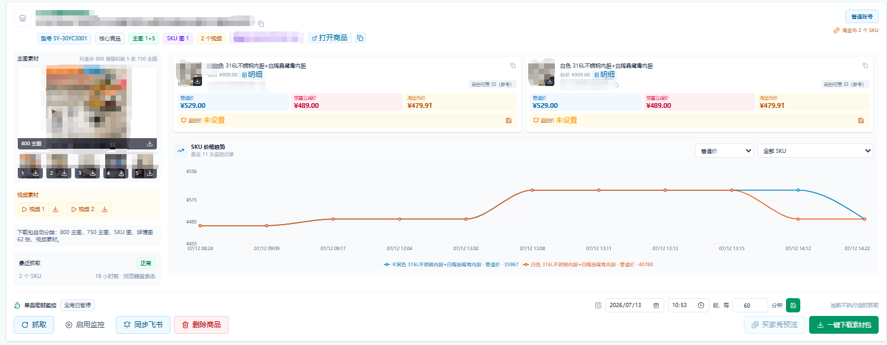

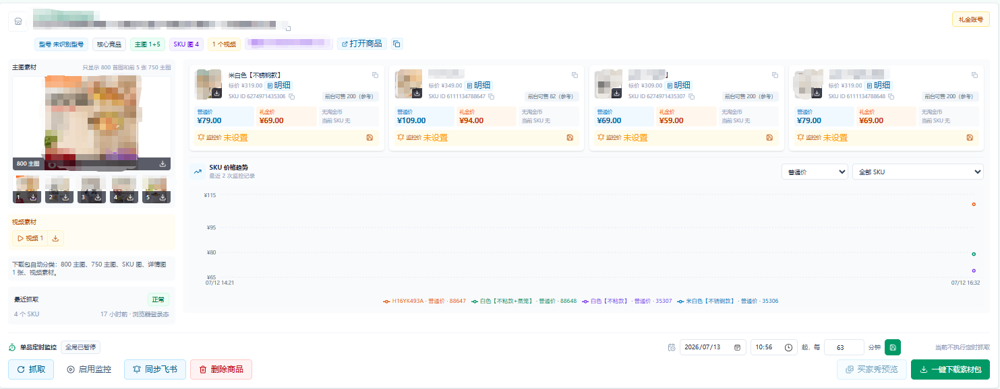

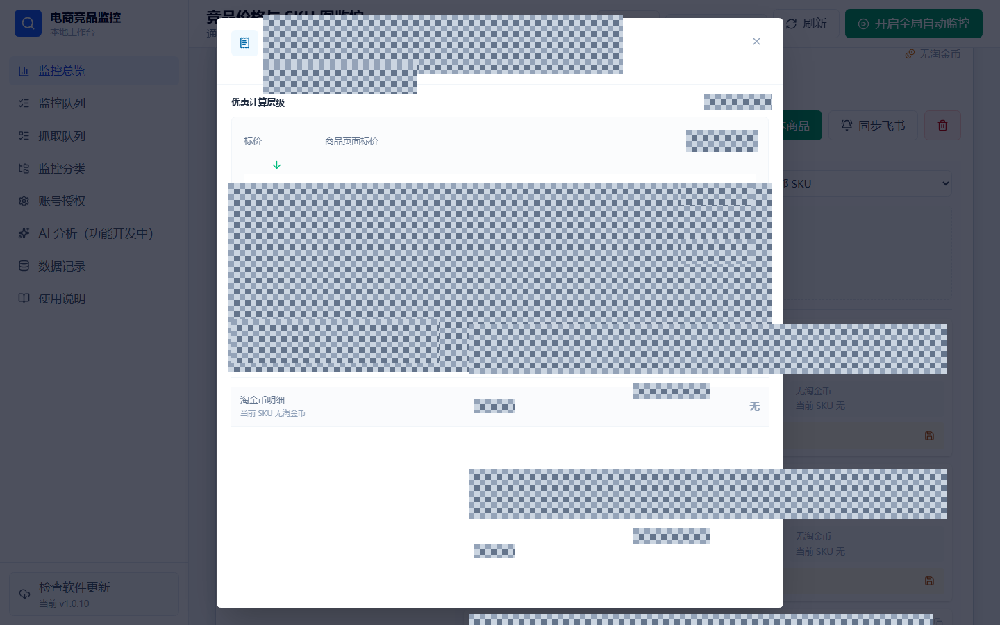

库存来自淘宝买家商品页，可能受账号、收货地区、活动、限购和平台展示上限影响，不等于商家后台仓库库存。

## 六、设置价格监控

监控价按 SKU 独立设置，不是一个商品共用一个价格。

1. 在 SKU 卡片的“监控价”输入目标价格。
2. 点击保存。
3. 后续抓取到该 SKU 的有效价格低于监控价时，触发飞书提醒。
4. 清空监控价并保存即可关闭该 SKU 的预警。

价格更新不会清除监控价。系统会在每次抓取后使用最新 SKU 价格重新判断。

价格趋势可以切换普通/淘宝秒杀价、国补价、惊喜立减价、淘金币价、礼金价或 88VIP 价，并可筛选单个 SKU。

## 七、定时监控和手动抓取

### 全局定时监控

在“定时价格监控”设置默认抓取间隔并保存。暂停后不会继续自动抓取，恢复后才会重新调度。

### 单品定时监控

商品卡片底部提供两种互斥模式，同一商品只会执行一种：

- **单次定时**：只在指定日期和时间执行一次，完成后自动暂停本商品，不会再按分钟循环。
- **循环监控**：从保存计划后开始，只按设置的分钟周期循环，不读取日期和时间；未单独设置周期时使用全局默认周期。

自动抓取必须同时满足三个条件：

1. 页面顶部“全局自动监控”已开启。
2. 当前商品已点击“启用本商品”。
3. 已到达商品计划的下次抓取时间。

暂停全局或暂停本商品不会删除尚未执行的计划、SKU 监控价和历史记录。单次定时执行成功后会清除已完成时间并暂停本商品，避免重复执行。卡片底部会同时显示两个开关的真实状态，缺少哪个条件可在对应位置直接操作。

### 监控队列

左侧“监控队列”只展示已启用商品，默认按下次抓取时间排序，每页 10 个。队列会明确显示“单次定时”或“循环监控”，并展示下次时间、上次抓取与 SKU 数量，也可以立即抓取或将商品移出队列。全局暂停时队列不会清空，商品统一显示“等待全局开启”。

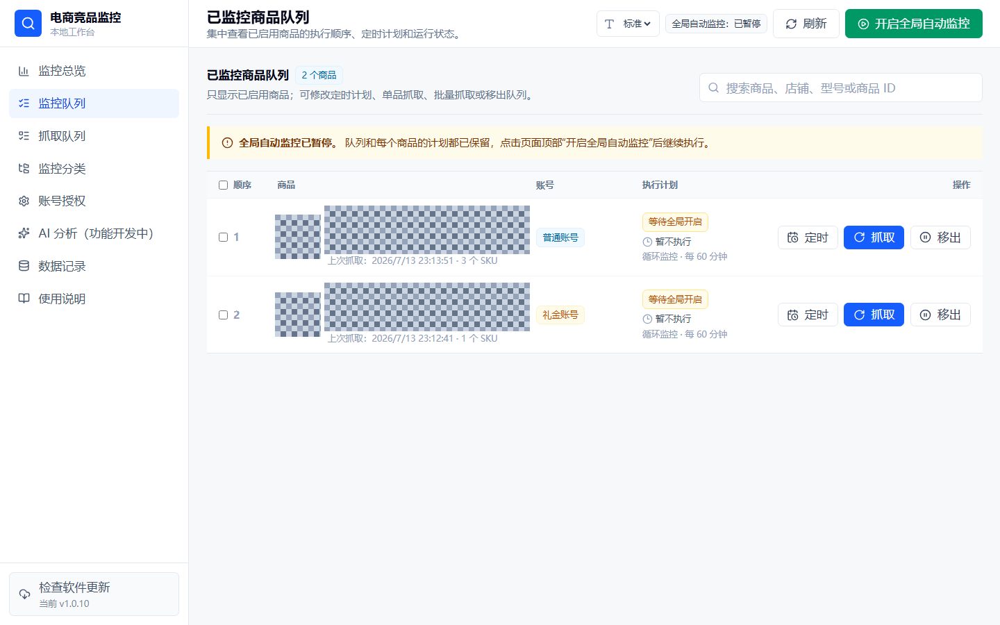

### 抓取队列

左侧“抓取队列”展示单品、批量和定时任务的排队顺序、当前进度、来源与结果。任务归后端执行，刷新网页或切换菜单不会取消；重新进入抓取队列即可继续查看。批量任务仍只占一个队列任务，内部最多并发 5 个商品。完成或失败项保留 5 秒用于确认结果，随后自动移出；长期结果在“数据记录”的运行日志中查看。

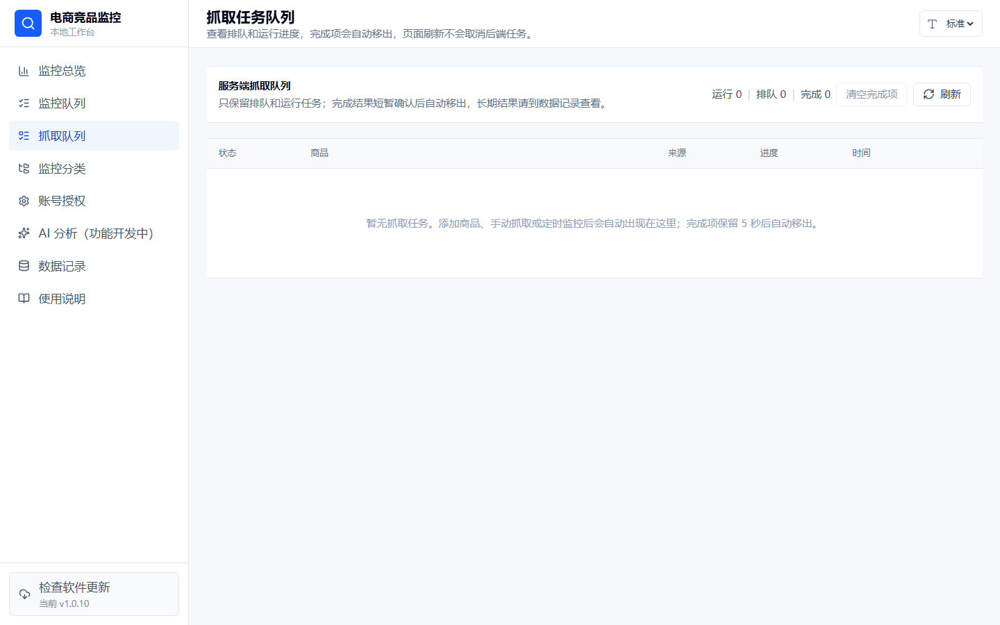

退出整个软件会终止当前进程，未完成任务不会自动续跑；重新打开后可按失败记录手动重试。

### 手动抓取

商品卡片上的“抓取”只抓当前商品。监控分类中的批量抓取会按选择顺序执行，不会同时启动无限数量的浏览器。

抓取浏览器使用独立账号目录并在后台或最小化运行，完成后保留登录目录。关闭抓取窗口不会删除账号登录资料。

## 八、分类、搜索和批量管理

“监控分类”支持：

- 按店铺和型号自动归档。
- 搜索商品、店铺、型号、SKU、账号类型和商品 ID。
- 筛选普通、礼金、88VIP、淘金币等价格类型。
- 按更新时间、商品名、店铺、型号、最低价和 SKU 数量排序。
- 批量抓取、批量下载买家秀和批量删除。

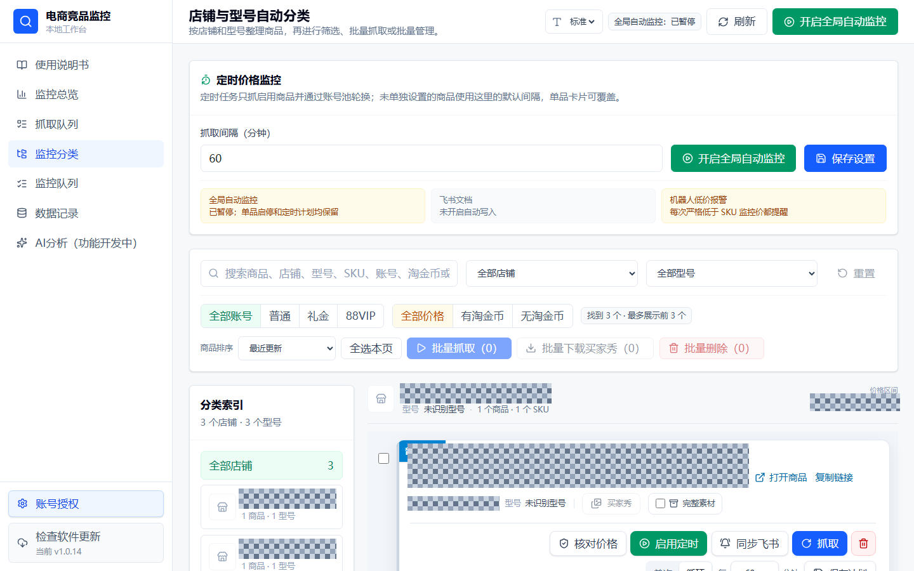

监控总览最多展示 20 个商品，每页 10 个；监控分类每页 10 个，最多保留 100 个商品。

## 九、连接飞书

### 飞书文档

1. 在“账号授权 → 飞书授权与文档”点击“扫码授权”。
2. 完成飞书网页登录授权。
3. 返回软件刷新授权状态。
4. 点击“创建价格文档”。

之后每次抓取成功都会按店铺、型号和 SKU 追加价格记录。机器人提醒处于冷却期时，文档同步仍会继续。

### 飞书机器人

1. 在飞书群中添加自定义机器人。
2. 将机器人 Webhook 填入软件。
3. 如机器人启用了签名校验，再填写签名密钥。
4. 设置提醒冷却时间并保存。
5. 点击“发送测试”确认连接。

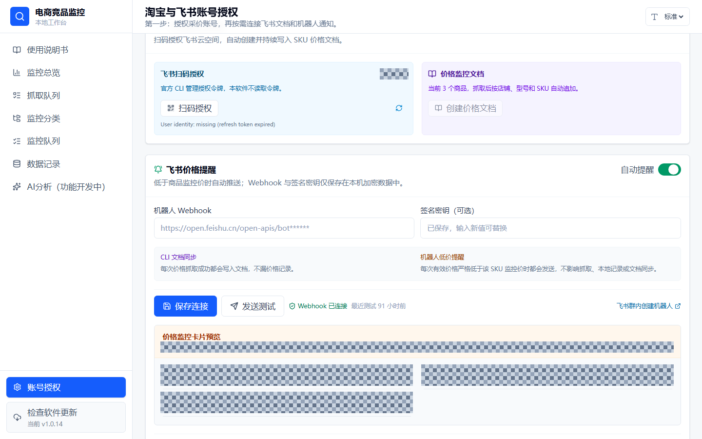

提醒消息会展示店铺、型号、各 SKU 名称、普通/淘宝秒杀价、惊喜立减价、淘金币价、礼金价或 88VIP 价，以及触发监控价的 SKU。

提醒冷却只抑制同一商品、同一 SKU 的重复低价消息，不会暂停抓取、本地记录或飞书文档同步。冷却开关可以关闭。

## 十、素材和买家秀下载

- “一键下载素材包”会将主图、SKU 图、详情图和真实视频分类打包为 ZIP。
- 单张图片、单个视频和单个买家秀均提供独立下载按钮。
- “买家秀预览”只展示真实抓取到的图片、视频和评价文案。
- 新增商品时默认不抓买家秀；勾选“同时抓取买家秀”后，该商品的首次、手动和定时抓取才会自动包含买家秀。
- 监控分类支持批量下载已选商品的买家秀。
- 生成 ZIP 时按钮会显示“生成中”，商品卡片下方会持续显示进行中、完成或失败原因；请等到“下载已开始”后再关闭软件。
- 买家秀会优先分页抓取带图片或视频的评价，并与该商品历史结果去重合并。淘宝页面偶尔只返回少量文字时，不会再覆盖之前已经抓到的完整图片和视频。
- 已关闭自动买家秀的商品仍可点击“仅重试买家秀”，只补买家秀，不重新计算价格或素材。

### 运行状态提示

抓取价格、暂停或启用监控、保存定时计划、同步飞书、生成素材包、下载买家秀和批量任务都会显示动态状态：

- 蓝色旋转图标：任务正在执行，请保持软件运行。
- 绿色完成图标：任务已完成，数据已刷新或文件已开始下载。
- 红色错误图标：任务未完成，状态条会保留具体失败原因，按提示检查账号、飞书连接或网络后重试。

## 十一、常见问题

### 点击抓取后显示倒计时

这是软件设置的采集保护时间，不是淘宝风控。可以等待倒计时结束，或在账号授权页面关闭保护。

### 抓取价格与自己看到的不一样

价格可能受账号类型、地区、活动时间、淘金币开关、礼金资格、88VIP 身份和 SKU 选择影响。先确认使用了正确账号和 SKU，再重新抓取。

### 淘宝账号掉线

在账号卡片点击“检测登录”。掉线后点击“重新授权”，不要删除账号卡片重新添加。

### macOS 提示无法打开或无法验证开发者

这是未签名应用的系统提示。在应用上右键选择“打开”，或前往“系统设置 → 隐私与安全性”允许打开。

### 飞书没有收到提醒

依次检查：Webhook 是否已保存、测试消息是否成功、自动提醒开关是否开启、SKU 是否设置监控价、当前价格是否低于监控价、同一 SKU 是否仍在提醒冷却期。

## 十二、隐私说明

- 商品数据库、账号浏览器目录、Cookie、飞书令牌、Webhook 和签名密钥只保存在当前电脑。
- 安装包和 GitHub 源码不包含任何使用者的运行数据。
- 分享截图前请隐藏店铺名、商品名、商品 ID、SKU ID、商品图片和账号信息。
- 仓库文档截图还会遮挡型号、实际价格、库存、用户分组和飞书业务内容；截图脚本只写脱敏结果，不保存未脱敏原图。

## 十三、版本更新

侧边栏底部常驻“检查软件更新”。软件启动后会连接本项目 GitHub Releases 检查最新正式版：

1. 点击更新入口查看当前版本、最新版本、发布日期和更新说明。
2. 软件会在启动以及从后台回到前台时主动检查，不会在后台频繁轮询；发现新版本会自动提醒，同一版本不会反复弹窗。
3. 软件会根据 Windows、macOS Intel 或 macOS Apple Silicon 自动选择安装包。
4. 国内网络优先点击“加速下载”；镜像不可用时切换“GitHub 原地址”。
5. 下载前可核对安装包大小和 GitHub 返回的 SHA-256。
6. 下载完成后先退出软件，再运行安装包覆盖安装。
7. 商品、历史价格、SKU 监控价、账号浏览器目录和飞书配置保存在用户数据目录，覆盖安装不会删除。

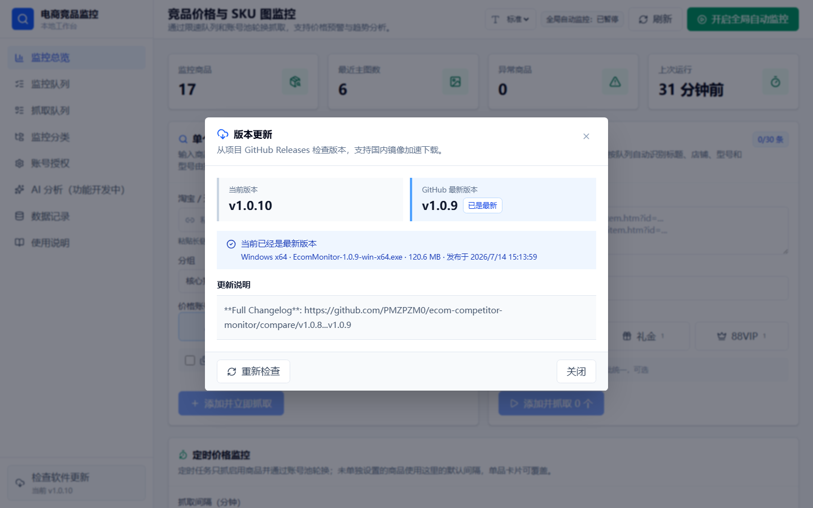

GitHub 暂时无法连接只会影响检查更新，不会影响本地抓取、定时监控和飞书同步。
