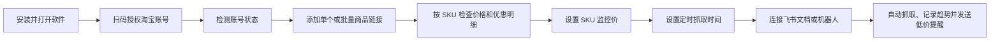

# 电商竞品监控使用说明书

本文面向第一次使用本软件的同事，按顺序完成安装、账号授权、商品抓取、价格监控和飞书提醒。

## 一、完整使用流程

## 二、安装软件

在 GitHub Releases 下载对应系统的安装包：

- Windows：`EcomMonitor-1.0.0-Windows-x64.exe`
- Intel 芯片 Mac：`EcomMonitor-1.0.0-macOS-Intel.dmg`
- Apple M1/M2/M3/M4 芯片 Mac：`EcomMonitor-1.0.0-macOS-AppleSilicon.dmg`

macOS 版本目前没有 Apple 开发者签名。若系统提示无法验证开发者，请在“系统设置 → 隐私与安全性”中选择“仍要打开”，或者在应用图标上右键选择“打开”。

每台电脑的数据独立保存。安装包不会携带开发者的商品、账号、Cookie、Webhook 或浏览器登录资料。

## 三、首次授权淘宝账号

1. 打开左侧“账号授权”。
2. 选择账号类型：普通账号、礼金账号或 88VIP 账号。
3. 填写容易识别的账号备注。
4. 点击“打开扫码登录”，使用淘宝 App 扫码。
5. 登录完成后返回软件，点击“检测登录”。
6. 状态显示“已检测在线”后，账号才会参与采价。

建议每种价格使用对应账号池：

- 普通账号：采集普通价、活动价、惊喜立减价和淘金币价。
- 礼金账号：采集首单礼金或新人专享价格。
- 88VIP 账号：采集 88VIP 专享价格。

账号掉线时点击“重新授权”。“一键检测全部”会检查账号池中所有账号，不会开始商品抓取。

“采集保护时间”只是本软件的访问间隔，不代表淘宝账号被风控。需要连续测试时可以关闭保护，长期自动监控建议保留合理间隔。

## 四、添加和抓取商品

### 单个商品

1. 打开“监控总览”。
2. 将淘宝或天猫商品链接粘贴到“商品链接”。
3. 可填写商品简称和分组。
4. 选择参与采价的账号类型。
5. 点击“添加并立即抓取”。

软件会自动清理链接中的无用跟踪参数，只保留有效商品地址。

### 批量商品

1. 在“批量添加并抓取”中一行粘贴一个新商品链接。
2. 一次最多添加 30 条链接。
3. 点击批量抓取后，最多 5 个商品并行，其余商品按顺序排队。
4. 批量功能用于添加新链接，不会重复抓取已经存在的商品。

## 五、查看商品和 SKU 数据

抓取完成后，商品卡片会展示：

- 800 主图和前 5 张 750 主图。
- 真实存在的视频素材。
- SKU 图片、SKU 名称和前台可售库存参考。
- 标价、普通价、惊喜立减价、淘金币价、礼金价和 88VIP 价。
- 每个 SKU 独立的优惠明细和价格趋势。
- 买家秀图片、视频和评价文案预览及下载。

库存来自淘宝买家商品页，可能受账号、收货地区、活动、限购和平台展示上限影响，不等于商家后台仓库库存。

## 六、设置价格监控

监控价按 SKU 独立设置，不是一个商品共用一个价格。

1. 在 SKU 卡片的“监控价”输入目标价格。
2. 点击保存。
3. 后续抓取到该 SKU 的有效价格低于监控价时，触发飞书提醒。
4. 清空监控价并保存即可关闭该 SKU 的预警。

价格更新不会清除监控价。系统会在每次抓取后使用最新 SKU 价格重新判断。

价格趋势可以切换普通价、惊喜立减价、淘金币价、礼金价或 88VIP 价，并可筛选单个 SKU。

## 七、定时监控和手动抓取

### 全局定时监控

在“定时价格监控”设置默认抓取间隔并保存。暂停后不会继续自动抓取，恢复后才会重新调度。

### 单品定时监控

商品卡片底部可以设置指定日期、时间和重复间隔。单品设置会覆盖全局默认间隔。

### 手动抓取

商品卡片上的“抓取”只抓当前商品。监控分类中的批量抓取会按选择顺序执行，不会同时启动无限数量的浏览器。

抓取浏览器使用独立账号目录并在后台或最小化运行，完成后保留登录目录。关闭抓取窗口不会删除账号登录资料。

## 八、分类、搜索和批量管理

“监控分类”支持：

- 按店铺和型号自动归档。
- 搜索商品、店铺、型号、SKU、账号类型和商品 ID。
- 筛选普通、礼金、88VIP、淘金币等价格类型。
- 按更新时间、商品名、店铺、型号、最低价和 SKU 数量排序。
- 批量抓取、批量下载买家秀和批量删除。

监控总览最多展示 20 个商品，每页 10 个；监控分类每页 10 个，最多保留 100 个商品。

## 九、连接飞书

### 飞书文档

1. 在“账号授权 → 飞书授权与文档”点击“扫码授权”。
2. 完成飞书网页登录授权。
3. 返回软件刷新授权状态。
4. 点击“创建价格文档”。

之后每次抓取成功都会按店铺、型号和 SKU 追加价格记录。机器人提醒处于冷却期时，文档同步仍会继续。

### 飞书机器人

1. 在飞书群中添加自定义机器人。
2. 将机器人 Webhook 填入软件。
3. 如机器人启用了签名校验，再填写签名密钥。
4. 设置提醒冷却时间并保存。
5. 点击“发送测试”确认连接。

提醒消息会展示店铺、型号、各 SKU 名称、普通价、惊喜立减价、淘金币价、礼金价或 88VIP 价，以及触发监控价的 SKU。

提醒冷却只抑制同一商品、同一 SKU 的重复低价消息，不会暂停抓取、本地记录或飞书文档同步。冷却开关可以关闭。

## 十、素材和买家秀下载

- “一键下载素材包”会将主图、SKU 图、详情图和真实视频分类打包为 ZIP。
- 单张图片、单个视频和单个买家秀均提供独立下载按钮。
- “买家秀预览”只展示真实抓取到的图片、视频和评价文案。
- 监控分类支持批量下载已选商品的买家秀。

## 十一、常见问题

### 点击抓取后显示倒计时

这是软件设置的采集保护时间，不是淘宝风控。可以等待倒计时结束，或在账号授权页面关闭保护。

### 抓取价格与自己看到的不一样

价格可能受账号类型、地区、活动时间、淘金币开关、礼金资格、88VIP 身份和 SKU 选择影响。先确认使用了正确账号和 SKU，再重新抓取。

### 淘宝账号掉线

在账号卡片点击“检测登录”。掉线后点击“重新授权”，不要删除账号卡片重新添加。

### macOS 提示无法打开或无法验证开发者

这是未签名应用的系统提示。在应用上右键选择“打开”，或前往“系统设置 → 隐私与安全性”允许打开。

### 飞书没有收到提醒

依次检查：Webhook 是否已保存、测试消息是否成功、自动提醒开关是否开启、SKU 是否设置监控价、当前价格是否低于监控价、同一 SKU 是否仍在提醒冷却期。

## 十二、隐私说明

- 商品数据库、账号浏览器目录、Cookie、飞书令牌、Webhook 和签名密钥只保存在当前电脑。
- 安装包和 GitHub 源码不包含任何使用者的运行数据。
- 分享截图前请隐藏店铺名、商品名、商品 ID、SKU ID、商品图片和账号信息。

