# 电商竞品监控使用说明书

本文面向第一次使用本软件的同事，按顺序完成启动方式选择、账号授权、商品抓取、价格监控和飞书提醒。

软件内也常驻“使用说明”页面，可在左侧菜单随时打开，不需要离开当前应用。

## 一、完整使用流程

```mermaid
flowchart LR
    A[安装并打开软件] --> B[选择桌面 APP 或浏览器网页]
    B --> C[扫码授权并检测淘宝账号]
    C --> D[输入单个或批量商品链接或 ID]
    D --> D1[账号浏览器在后台打开商品页]
    D1 --> D2[自动收集页面已加载的数据]
    D2 --> D3[脱敏落盘后重新读取解析]
    D3 --> E[按 SKU 检查价格和优惠明细]
    E --> F[设置 SKU 监控价]
    F --> G[设置定时抓取时间]
    G --> H[连接飞书文档或机器人]
    H --> I[自动抓取、记录趋势并发送低价提醒]
```

## 二、安装软件

在 GitHub Releases 的 Latest Release 下载对应系统的最新安装包：

- Windows：文件名包含 `win-x64.exe`。
- Intel 芯片 Mac：文件名包含 `mac-x64.dmg`。
- Apple M1/M2/M3/M4 芯片 Mac：文件名包含 `mac-arm64.dmg`。

macOS 安装包已完成 ad-hoc 完整性签名，但未使用 Apple Developer ID 公证。首次启动请按住 Control 点击应用并选择“打开”；若仍被拦截，请到“系统设置 > 隐私与安全性”点击“仍要打开”。

每台电脑的数据独立保存。安装包不会携带开发者的商品、账号、Cookie、Webhook 或浏览器登录资料。

首次启动会询问打开方式：

- **桌面 APP**：使用独立应用窗口。
- **浏览器网页**：启动同一套本机服务，并用系统默认浏览器打开；数据仍只保存在当前电脑，不是远程网页版。

勾选“记住我的选择”后，下次会直接启动。软件运行后可右键系统托盘图标，随时切换桌面 APP/浏览器网页，或选择“下次启动时重新选择”清除记忆。网页方式关闭浏览器标签后，本机服务仍驻留托盘；桌面 APP 方式关闭窗口会退出软件。需要确认完全停止时请在托盘点击“退出”。

## 三、首次授权淘宝账号

1. 打开左侧“账号授权”。
2. 选择账号类型：普通账号、礼金账号或 88VIP 账号。
3. 填写容易识别的账号备注。
4. 点击“打开扫码登录”，使用淘宝 App 扫码。
5. 登录完成后返回软件，点击“检测登录”。
6. 确认检测结果；未明确标记“登录失效”的扫码账号会进入抓取候选。

每种账号都会采集当前页面可见的全部公共价格，不需要为了公共价格额外配置普通账号：

- 普通账号：普通价、淘宝秒杀价、国补价、惊喜立减价、淘金币价等公共通道。
- 礼金账号：全部可见公共通道，再加有真实资格依据的礼金价。
- 88VIP 账号：全部可见公共通道，再加页面实际返回的礼金价和 88VIP 价。

添加商品时选择的是**主监控账号类型**。日常价格任务只从该类型的账号池中选择账号，单次任务最多尝试 2 个同类型账号；普通、礼金、88VIP 之间禁止静默替换。两个同类型账号都不可用或证据不足时，本次任务会明确失败或等待授权，不会拿其他账号类型、标价或历史结果补造当前价格。

多账号结果按账号视角完全隔离，不会互相覆盖。主账号视角用于 SKU 阈值判断、价格记录和飞书同步；其他账号视角只读，只有用户明确点击刷新该视角时才会采集，不会自动执行，也不能修改监控规则。切换展示不会改变主账号来源。

“一键检测全部”只检查账号池登录状态，不会开始商品抓取。“待复检”表示检测页临时异常但浏览器登录资料仍保留，可稍后再检测；只有明确跳转登录页才会标记“登录失效”，此时点击“重新授权”。

## 四、添加商品：自动采集并本地解析

### 单个商品

1. 打开“监控总览”。
2. 使用“商品链接”时，粘贴淘宝或天猫长链接；软件会自动清理跟踪参数。
3. 使用“商品 ID”时，只输入纯数字 ID 并选择淘宝或天猫，地址前缀会自动补全。
4. 选择主监控账号类型；需要 750 主图、详情图或视频时勾选“抓取完整素材”，需要买家秀时再勾选“同时抓取买家秀”。勾选项会分别加入完整素材队列或买家秀队列，不会混入价格任务。
5. 点击“自动采集并本地解析”。软件会在已授权账号浏览器中后台打开商品页，自动收集页面已加载的 HTML、可见优惠文字和价格响应。
6. 软件删除 Cookie、Authorization、Token、签名和账号身份字段，保存本地源文件，关闭写入后重新读盘；标题、店铺、型号、SKU 和价格只从读回的数据解析。
7. 新商品默认暂停监控。先核对价格和优惠明细，再设置监控价与定时计划。

软件会自动清理商品链接中的无用跟踪参数。每次成功抓取都会在商品卡片显示本地证据文件；单品、批量、定时与买家秀重试使用同一条“浏览器加载 → 脱敏落盘 → 读盘解析”链路。

### 批量商品

1. 在“批量添加并抓取”中选择“商品链接”或“商品 ID”，一行输入一个商品。
2. 商品 ID 模式只需输入纯数字并选择淘宝或天猫；一次最多添加 30 条。
3. “抓取完整素材”和“同时抓取买家秀”对本批商品统一生效，默认均关闭；启用后分别创建独立任务。
4. 点击“自动采集并本地解析”后，每个商品分别进入对应的持久 FIFO 队列并按入队顺序执行。每个商品都独立完成脱敏落盘和读盘解析后才写入结果。
5. 批量功能用于添加新商品，不会重复抓取已经存在的商品。

自动采集仍会通过已授权浏览器真实访问商品页。本地落盘用于固定解析证据、避免后端再直连详情/评价接口，不代表可以绕过淘宝风控；软件不会绕过验证码或安全验证。

## 五、查看商品和 SKU 数据

抓取完成后，商品卡片会展示：

- 默认抓取 800 主图和 SKU 图片。
- 开启“完整素材”后，额外抓取前 5 张 750 主图、详情图和真实存在的视频素材，并提供素材包下载。
- SKU 图片、SKU 名称和前台可售库存参考。
- 标价、普通价、淘宝秒杀价、国补价、惊喜立减价、淘金币价、礼金价和 88VIP 价。
- 每个 SKU 独立的优惠明细和价格趋势。
- 商品卡片可切换不同账号视角；各账号价格完全隔离，主账号视角用于监控，其他视角只读且必须显式刷新。
- 开启买家秀或单独重试成功后，可预览及下载买家秀图片、视频和评价文案。

库存来自淘宝买家商品页，可能受账号、收货地区、活动、限购和平台展示上限影响，不等于商家后台仓库库存。

## 六、设置价格监控

监控价按 SKU 独立设置，不是一个商品共用一个价格。

1. 在 SKU 卡片的“监控价”输入目标价格。
2. 离开输入框会自动保存，按 Enter 可立即保存。
3. 为该 SKU 选择监控口径：最低有效价 `lowest`、普通价 `normal`、国补价 `government`、惊喜立减价 `surprise`、礼金价 `gift`、88VIP 价 `vip88` 或淘金币价 `coin`。
4. 后续抓取到该 SKU 主账号视角的已验证价格低于监控价时，按价格状态变化判断是否触发飞书提醒。
5. 清空监控价并离开输入框即可关闭该 SKU 的预警。

价格更新不会清除监控价。系统会在每次抓取后使用最新的主账号视角价格重新判断；在商品卡片切换账号只改变展示，不会改动监控来源。

价格趋势可以切换普通/淘宝秒杀价、国补价、惊喜立减价、淘金币价、礼金价或 88VIP 价，并可筛选单个 SKU。证据不足时价格标记为“未验证”，不会保存猜测值；历史旧结果只显示“上次已验证”，不参与当前告警。

成功抓取证据保留 7 天，失败证据保留 30 天，证据目录总量上限为 10 GB，软件会自动清理超期内容。新价格引擎先旁路记录影子结果，不覆盖正式价格、不触发告警；只有完成 10 个连续无异常的影子核验轮次后，才标记为可启用。

## 七、定时监控和手动抓取

### 全局定时监控

页面顶部可开启或暂停全局自动监控。暂停后不会继续自动抓取，恢复后才会重新调度。日常自动监控使用每天 08:00、11:00、14:00、17:00、20:00、23:00 六个执行窗口，商品会在窗口内分散入队，避免同一时刻集中访问。

### 单品定时监控

商品卡片底部提供两种互斥模式，同一商品只会执行一种：

- **单次定时**：只在指定日期和时间执行一次，完成后自动暂停本商品，不会再按分钟循环。
- **六窗口监控**：每天进入 08:00、11:00、14:00、17:00、20:00、23:00 六个窗口，各商品在窗口内分散执行，不再同时叠加按分钟循环。

自动抓取必须同时满足三个条件：

1. 页面顶部“全局自动监控”已开启。
2. 当前商品已点击“启用本商品”。
3. 已到达商品计划的下次抓取时间。

暂停全局或暂停本商品不会删除尚未执行的计划、SKU 监控价和历史记录。单次定时执行成功后会清除已完成时间并暂停本商品，避免重复执行。卡片底部会同时显示两个开关的真实状态，缺少哪个条件可在对应位置直接操作。

### 监控队列

左侧“监控队列”只展示已启用商品，默认按下次抓取时间排序，每页 10 个。队列会明确显示“单次定时”或“六窗口监控”，并展示下次时间、上次抓取与 SKU 数量，也可以立即抓取或将商品移出队列。全局暂停时队列不会清空，商品统一显示“等待全局开启”。

### 抓取队列

左侧“抓取队列”分别展示价格、买家秀和完整素材三条持久 FIFO 队列。三类任务按各自的入队顺序执行并独立写入数据：价格任务不会改买家秀或完整素材，买家秀和完整素材任务也不会改价格、趋势、监控状态或触发飞书。

刷新网页、切换菜单或重启软件不会清空队列；重启后会恢复未完成任务。需要登录的任务会保留为“待授权”，扫码重新授权或账号恢复后可继续。临时失败只重试失败商品，依次等待 1、5、15 分钟；不会重新执行同批中已经成功的商品。已完成与最终失败任务默认保留 7 天供核对和手动重试，队列记录最多 200 条，也可手动清理，不再 5 秒自动移除。

退出整个软件会停止当前运行中的浏览器操作，但队列状态会保留；重新打开后由后端恢复未完成任务。

### 手动抓取

商品卡片上的“抓取”只抓当前商品。监控分类中的批量抓取按账号隔离执行，同一个账号绝不会同时抓多个商品；页面跳转成其他商品 ID 时会拒绝保存，避免串品。

抓取浏览器使用独立账号目录并在后台或最小化运行，完成后保留登录目录。关闭抓取窗口不会删除账号登录资料。

## 八、分类、搜索和批量管理

“监控分类”支持：

- 按店铺和型号自动归档。
- 搜索商品、店铺、型号、SKU、账号类型和商品 ID。
- 筛选普通、礼金、88VIP、淘金币等价格类型。
- 按更新时间、商品名、店铺、型号、最低价和 SKU 数量排序。
- 批量抓取、批量下载买家秀和批量删除。

监控总览最多展示 20 个商品，每页 10 个；监控分类每页 10 个，最多保留 100 个商品。

## 九、连接飞书

### 飞书文档

1. 在“账号授权 → 飞书授权与文档”点击“扫码授权”。
2. 完成飞书网页登录授权。
3. 返回软件刷新授权状态。
4. 点击“创建价格文档”。

之后每次价格抓取成功都会按店铺、型号和 SKU 追加主账号视角的已验证价格记录，并标注账号类型。非主账号的只读视角不会自动写入监控文档。

### 飞书机器人

1. 在飞书群中添加自定义机器人。
2. 将机器人 Webhook 填入软件。
3. 如机器人启用了签名校验，再填写签名密钥。
4. 保存连接并开启自动提醒。
5. 点击“发送测试”确认连接。

提醒消息会展示店铺、型号、各 SKU 名称、主账号视角的普通/淘宝秒杀价、惊喜立减价、淘金币价、礼金价或 88VIP 价，以及触发监控价的 SKU。

同一商品、同一 SKU、同一主账号类型按监控口径独立维护告警状态。机器人只在首次跌破监控价、跌破后继续创下新低、或价格恢复到阈值及以上后再次跌破时提醒；低于阈值但价格未创新低时不会重复打扰。历史旧价和“上次已验证”值不参与告警。

提醒会先写入本机持久出站队列，再尝试发送。网络或飞书临时失败时会保留待发送消息并重试，避免因界面刷新或软件重启丢失提醒。

## 十、素材和买家秀下载

- 需要素材包时，先在商品卡片开启“完整素材”并重新抓取；“一键下载素材包”会将主图、SKU 图、详情图和真实视频分类打包为 ZIP。
- 单张图片、单个视频和单个买家秀均提供独立下载按钮。
- “买家秀预览”只展示真实抓取到的图片、视频和评价文案。
- 新增商品时默认不抓买家秀；勾选“同时抓取买家秀”后会创建独立买家秀任务，不会重新计算价格或完整素材。
- 监控分类支持批量下载已选商品的买家秀。
- 生成 ZIP 时按钮会显示“生成中”，商品卡片下方会持续显示进行中、完成或失败原因；请等到“下载已开始”后再关闭软件。
- 买家秀会优先分页抓取带图片或视频的评价，并与该商品历史结果去重合并。淘宝页面偶尔只返回少量文字时，不会再覆盖之前已经抓到的完整图片和视频。
- 已关闭自动买家秀的商品仍可点击“仅重试买家秀”，只补买家秀，不重新计算价格或素材。

### 运行状态提示

抓取价格、暂停或启用监控、保存定时计划、同步飞书、生成素材包、下载买家秀和批量任务都会显示动态状态：

- 蓝色旋转图标：任务正在执行，请保持软件运行。
- 绿色完成图标：任务已完成，数据已刷新或文件已开始下载。
- 红色错误图标：任务未完成，状态条会保留具体失败原因，按提示检查账号、飞书连接或网络后重试。

## 十一、AI 创作

### 第一次配置模型

1. 打开左侧“AI 创作”，点击创作台右上角“设置”。
2. 每位同事都要在**自己的电脑、本机安装**中填写自己的 API Key。不要把同事的 Key 写进安装包，也不要多人共用同一个应用数据目录；不同电脑上的配置和用量彼此独立。
3. 日常使用选择“稳定通道（推荐）”或“高速通道”。两条通道使用内置地址和默认模型 `gpt-image-2`、`gpt-5.5`，并分别保存各自的 Key。需要其他 OpenAI 兼容接口时，展开“高级设置”，启用自定义接口后再填写 API 地址、图片模型和提示词/分析模型。
4. 保存配置后分别点击“测试提示词”和“测试生图”。提示词测试会发送一条极短文本，可能产生极少量文本用量；生图测试只检查当前通道、Key 与图片模型，不会生成图片。两项都通过才表示 AI 创作模型完整可用。

### 一句话开始创作

1. “商品生图”用于白底主图、场景图、活动海报、换背景或产品精修，必须上传 1～3 张能看清产品结构的参考图。“自由生图”适合不依赖具体商品的画面，参考图可不传，最多 3 张。
2. 参考图可选择、拖入或直接粘贴，支持 PNG、JPEG 和 WEBP；单张超过 8 MB 时软件会先在本机自动压缩。
3. 只写本次想生成或修改的内容，例如“把产品放进明亮的现代厨房，画面干净，产品保持原样”。系统会在后台补全专业提示词、排除要求、文字防错与产品保真规范，再自动加入生图队列。
4. 选择画面比例、1K/2K/4K 清晰度和 1/2/4 张生成数量；质量、格式、背景和额外排除要求在“更多设置”中。1K 是标准输出，2K 和 4K 会在模型生成后由本机增强，并记录原生尺寸和输出尺寸。
5. 任务成功入队后可立即准备下一张，不必等待当前图片完成。切换菜单或刷新页面不会清空后台队列；失败任务可在队列中重试，进行中的任务也可取消。
6. 系统会自动约束文字、数字、单位、标点、Logo、产品结构、颜色和关键部件；未要求时不自行添加文案、价格、促销标签、二维码、水印或品牌。模型仍可能偶发生成错误，正式使用前请放大核对。

### 专业控制与图片管理

1. 普通任务不用单独写专业提示词。需要逐项控制产品事实、风格、文案和修改边界时，点击创作台右上角“专业提示词”；白底主图、产品场景图、活动海报、详情页配图、局部改图、换背景和产品精修七类任务仍保留在这里。
2. 专业提示词同步回 AI 创作后不会被再次改写，也不会自动生图；确认内容后再点击生成，才会产生生图费用。
3. 图片自动保存到生成历史；点击收藏后进入收藏相册。详情中可下载、删除、复用参数，或选择“基于此图”继续修改。
4. 需要局部修改时，在图片详情点击“批注编辑”。可拖拽框选修改区域，或点击图片放置编号备注点；系统会尽量保持未标注区域不变，修改结果作为独立版本保存，原图不会被覆盖。
5. 需要在 Photoshop 精修时，点击“Photoshop 编辑”。软件会在本机创建独立 PNG 工作副本并打开 PS；修改后按 `Ctrl/Cmd+S` 直接保存，再回到图片详情点击“同步 PS 修改”。Photoshop 必须安装在运行软件的同一台电脑。
6. 自定义兼容网关必须支持 `/images/edits` 才能使用参考图或批注编辑；不支持时软件会明确提示，不会悄悄退回普通文生图。

提示词草稿、参数、生图队列、生成历史和收藏相册保存在当前电脑。API Key 使用加密字段落盘，界面与接口只显示脱敏状态；需要删除时，在模型设置中点击对应通道的“清除 Key”。

## 十二、常见问题

### 抓取价格与自己看到的不一样

价格可能受账号类型、地区、活动时间、淘金币开关、礼金资格、88VIP 身份和 SKU 选择影响。先确认使用了正确账号和 SKU，再重新抓取。

### 淘宝账号待复检或登录失效

“待复检”表示检测页临时异常，不等于账号退出，浏览器登录资料会继续保留，可稍后点击“检测登录”。“登录失效”只在页面明确跳转登录页时出现，此时点击“重新授权”，不用删除账号卡片。

### macOS 首次打开提示“无法验证开发者”

安装包已完成 ad-hoc 完整性签名，但未使用付费 Apple Developer ID 公证，因此首次启动仍会被 Gatekeeper 拦截。这不是 M1/M2/M3/M4 架构选错，也不代表应用文件损坏。

1. 把“电商竞品监控”拖入“应用程序”。
2. 在“应用程序”中按住 Control 点击应用，选择“打开”，再确认一次“打开”。
3. 如果没有“打开”选项，先尝试启动一次，再进入“系统设置 > 隐私与安全性”，在安全提示旁点击“仍要打开”。

只下载本仓库官方 Release，并在更新窗口核对 GitHub 返回的 SHA-256。完成首次确认后，后续可正常双击启动。

若使用旧版安装包仍提示“应用已损坏”，请删除旧应用并安装最新版；不要继续使用旧包。

### 飞书没有收到提醒

依次检查：Webhook 是否已保存、测试消息是否成功、自动提醒开关是否开启、SKU 是否设置监控价、主账号视角的当前有效价格是否严格低于监控价。

## 十三、隐私说明

- 商品数据库、账号浏览器目录、Cookie、飞书令牌、Webhook 和签名密钥只保存在当前电脑。
- 安装包和 GitHub 源码不包含任何使用者的运行数据。
- 分享截图前请隐藏店铺名、商品名、商品 ID、SKU ID、商品图片和账号信息。
- 仓库文档截图还会遮挡型号、实际价格、库存、用户分组和飞书业务内容；截图脚本只写脱敏结果，不保存未脱敏原图。

## 十四、版本更新

侧边栏底部常驻“检查软件更新”。软件启动后会连接本项目 GitHub Releases 检查最新正式版：

1. 点击更新入口查看当前版本、最新版本、发布日期和更新说明。
2. 软件会在启动以及从后台回到前台时主动检查，不会在后台频繁轮询；发现新版本会自动提醒，同一版本不会反复弹窗。
3. 软件会根据 Windows、macOS Intel 或 macOS Apple Silicon 自动选择安装包。
4. 国内网络优先点击“加速下载”；镜像不可用时切换“GitHub 原地址”。
5. 下载前可核对安装包大小和 GitHub 返回的 SHA-256。
6. 下载完成后先退出软件，再运行安装包覆盖安装。
7. 商品、历史价格、SKU 监控价、账号浏览器目录和飞书配置保存在用户数据目录，覆盖安装不会删除。

GitHub 暂时无法连接只会影响检查更新，不会影响本地抓取、定时监控和飞书同步。
